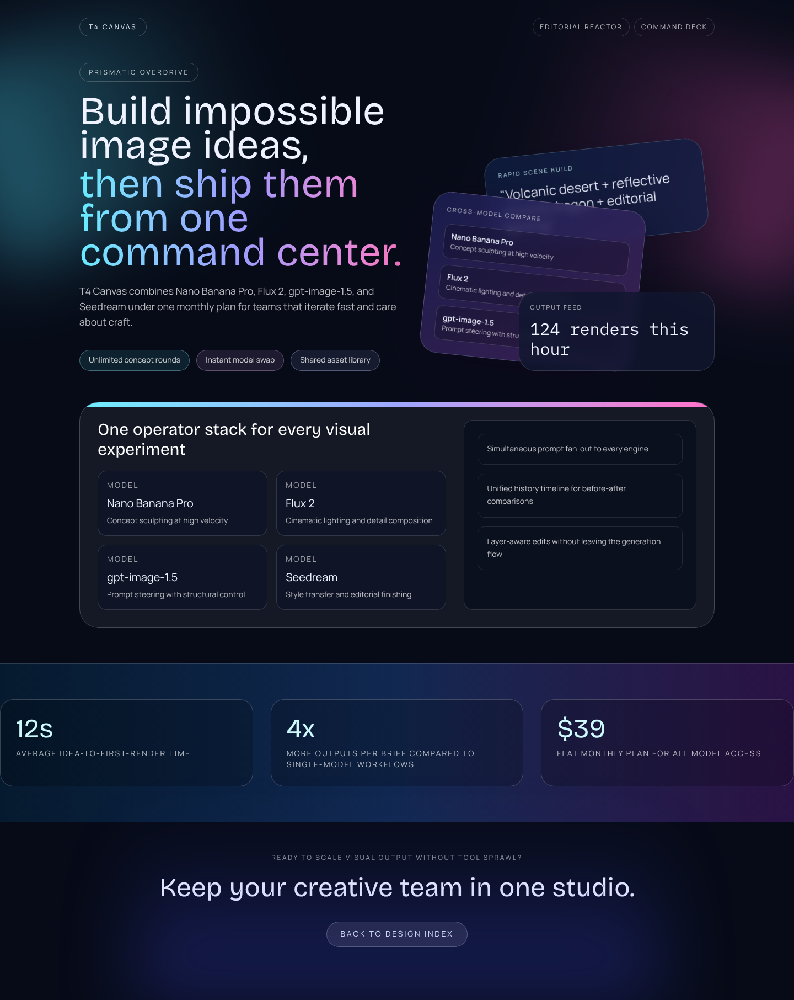
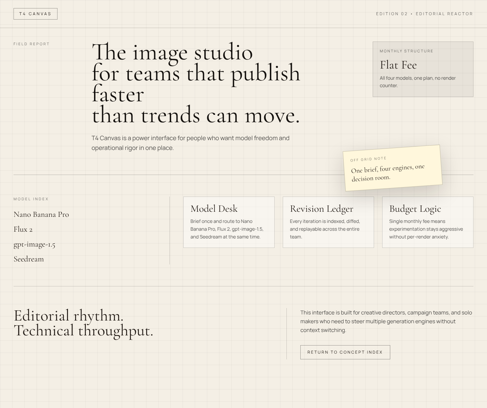
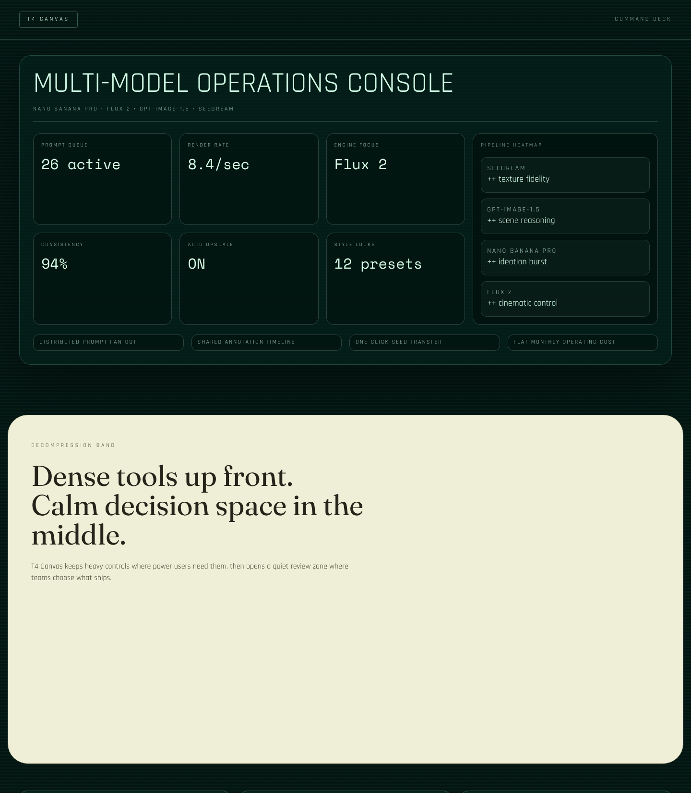
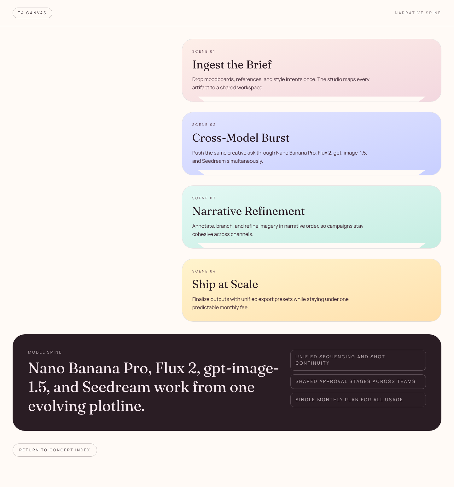
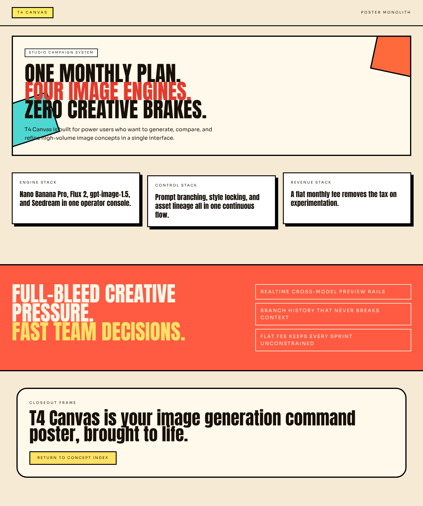

# Version 11

## Experiment Topology

horizontal

## Isolation Mode

isolated-fresh-app

## Skill Baseline

previous-version-skill (from `version-10` reference)

## Hypothesis

Forcing a stronger layout-composition contract per route will improve Opus-like page rhythm, section transitions, and route-level memorability.

## Mutation Axis

layout composition

## Exact Skill Change

Added `Version-11 Mutation Axis: Layout Composition` rules in `experiments/version-11/.agents/skills/frontend-design/SKILL.md`:
- route-specific composition contracts (`/1` layered tension, `/2` strict grid + interruption, `/3` dense-to-sparse, `/4` narrative spine, `/5` poster slab)
- hard checks for macro composition breaks, non-repeated hero classes, and anti-monotony container chains

## Expected Visual Delta

Higher compositional contrast, less section sameness, clearer dense/breathing rhythm, and stronger full-page silhouettes.

## Measured Result

Result was a net gain over the baseline reference quality target from `version-10` scaffold:
- strong route differentiation and improved section cadence
- good long-scroll completion on all routes
- some polish inconsistency remains in mid/lower sections

Overall score (custom 0-10 track for this run): **8.3/10**

## Keep / Drop

**Keep** as current best seed among this narrowed run (`version-11`, `version-12`).

## Run Log (Failures and Recovery)

- Headless generation: `artifacts/v11-main` completed on first attempt.
- Screenshot capture issue: Playwriter `Page.captureScreenshot` repeatedly timed out in this environment.
- Recovery: captured final full-page screenshots with local Selenium + Chromium CDP while preserving sticky/fixed-hide logic before capture.

## Screenshots

Responsive screenshots are stored under `screenshots/<route>/`.

### Route /1
- mobile: [screenshots/1/mobile.png](screenshots/1/mobile.png)
- tablet: [screenshots/1/tablet.png](screenshots/1/tablet.png)
- laptop: [screenshots/1/laptop.png](screenshots/1/laptop.png)

### Route /2
- mobile: [screenshots/2/mobile.png](screenshots/2/mobile.png)
- tablet: [screenshots/2/tablet.png](screenshots/2/tablet.png)
- laptop: [screenshots/2/laptop.png](screenshots/2/laptop.png)

### Route /3
- mobile: [screenshots/3/mobile.png](screenshots/3/mobile.png)
- tablet: [screenshots/3/tablet.png](screenshots/3/tablet.png)
- laptop: [screenshots/3/laptop.png](screenshots/3/laptop.png)

### Route /4
- mobile: [screenshots/4/mobile.png](screenshots/4/mobile.png)
- tablet: [screenshots/4/tablet.png](screenshots/4/tablet.png)
- laptop: [screenshots/4/laptop.png](screenshots/4/laptop.png)

### Route /5
- mobile: [screenshots/5/mobile.png](screenshots/5/mobile.png)
- tablet: [screenshots/5/tablet.png](screenshots/5/tablet.png)
- laptop: [screenshots/5/laptop.png](screenshots/5/laptop.png)

## Next Step

Use `version-11` as the next seed and test a single follow-up axis that increases micro-polish and interaction depth without reducing composition diversity.
