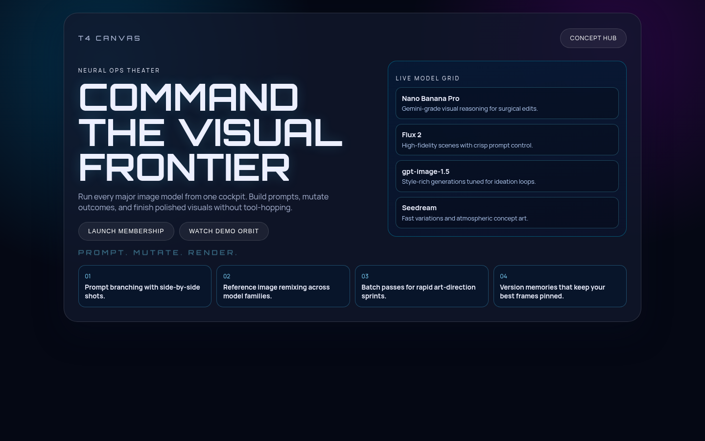
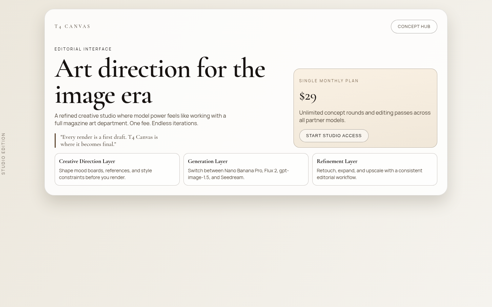
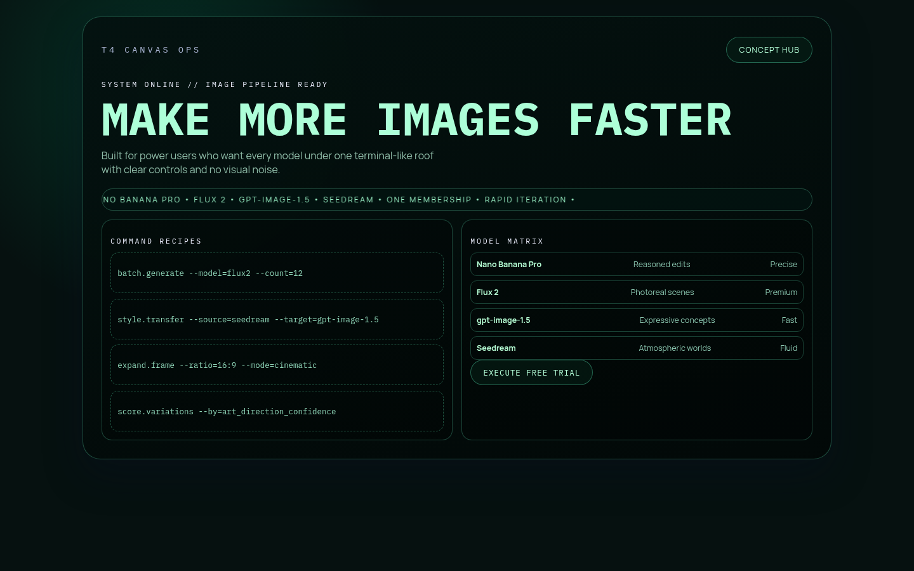

# Version 12

## Experiment Topology

horizontal

## Isolation Mode

isolated-fresh-app

## Skill Baseline

previous-version-skill (from `version-10` reference)

## Hypothesis

A strict typography-system mutation (distinct font voice, line-length control, and type hierarchy checks) will increase premium feel and readability while retaining route diversity.

## Mutation Axis

typography system

## Exact Skill Change

Added `Version-12 Mutation Axis: Typography System` rules in `experiments/version-12/.agents/skills/frontend-design/SKILL.md`:
- distinct display/body pairing pressure per route
- explicit hierarchy checks
- readability constraints on hero/body line measure
- mandatory typographic signature moments

## Expected Visual Delta

Sharper typographic identity, better readability control, and stronger route-specific tone.

## Measured Result

Typography quality improved, but composition depth and information density regressed relative to `version-11`:
- routes are cleaner and readable
- many pages end near first fold on laptop/tablet, reducing long-scroll narrative depth
- weaker Opus-like rhythm compared to `version-11`

Overall score (custom 0-10 track for this run): **7.7/10**

## Keep / Drop

**Partial keep**: retain specific typography constraints, but do not use this mutation alone as the next seed.

## Run Log (Failures and Recovery)

- Headless generation attempt: `artifacts/v12-main` stalled around interactive scaffolding behavior and produced an incomplete scaffold (`src/index.css` missing).
- Recovery attempt: `artifacts/v12-recovery` also partially stalled.
- Manual recovery completed:
  - finalized `t4-canvas` files from generated scaffold
  - fixed build break from Tailwind PostCSS mismatch by removing incompatible Tailwind plugin from `postcss.config.js`
  - validated with `bun run build`
- Screenshot capture issue: Playwriter `Page.captureScreenshot` repeatedly timed out.
- Recovery: captured final full-page screenshots with local Selenium + Chromium CDP while preserving sticky/fixed-hide logic before capture.

## Screenshots

Responsive screenshots are stored under `screenshots/<route>/`.

### Route /1
- mobile: [screenshots/1/mobile.png](screenshots/1/mobile.png)
- tablet: [screenshots/1/tablet.png](screenshots/1/tablet.png)
- laptop: [screenshots/1/laptop.png](screenshots/1/laptop.png)

### Route /2
- mobile: [screenshots/2/mobile.png](screenshots/2/mobile.png)
- tablet: [screenshots/2/tablet.png](screenshots/2/tablet.png)
- laptop: [screenshots/2/laptop.png](screenshots/2/laptop.png)

### Route /3
- mobile: [screenshots/3/mobile.png](screenshots/3/mobile.png)
- tablet: [screenshots/3/tablet.png](screenshots/3/tablet.png)
- laptop: [screenshots/3/laptop.png](screenshots/3/laptop.png)

### Route /4
- mobile: [screenshots/4/mobile.png](screenshots/4/mobile.png)
- tablet: [screenshots/4/tablet.png](screenshots/4/tablet.png)
- laptop: [screenshots/4/laptop.png](screenshots/4/laptop.png)

### Route /5
- mobile: [screenshots/5/mobile.png](screenshots/5/mobile.png)
- tablet: [screenshots/5/tablet.png](screenshots/5/tablet.png)
- laptop: [screenshots/5/laptop.png](screenshots/5/laptop.png)

## Next Step

Keep `version-11` as seed and re-introduce only the strongest typography checks as a secondary constraint, not as the primary axis.
