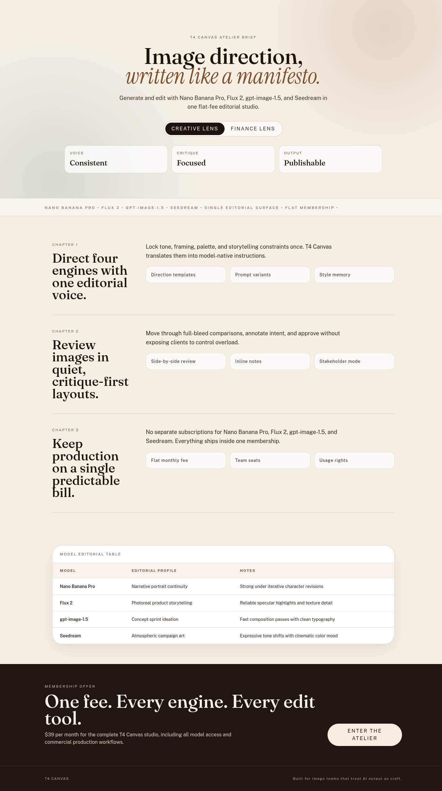
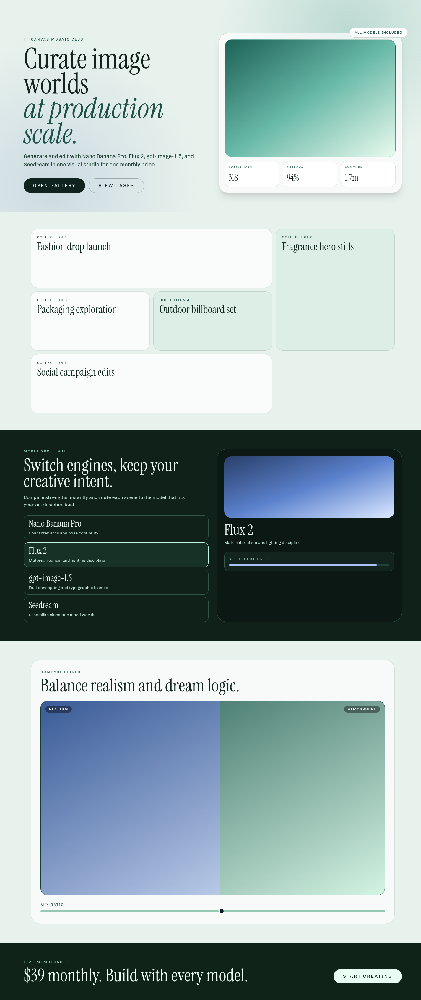
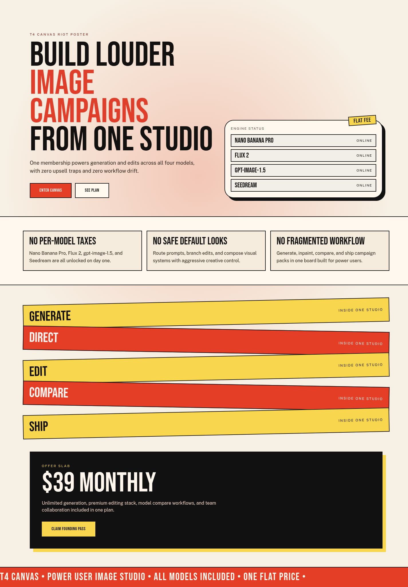

# Version 3

> [!WARNING]
> Archived on February 16, 2026 as a broken experiment.
> Do not use this run for benchmark scoring or baseline selection.

## Hypothesis

Stricter typography identity constraints will increase route-level personality and reduce repeated visual voice across `/1.. /5`, improving Opus-target similarity without harming readability.

## Mutation Axis

Typography identity (`references/mutation_axes.md`, axis 3).

## Exact Skill Change

Edited only `experiments/_archived/version-3/.agents/skills/frontend-design/SKILL.md` under `## Typography Rules` to add:
- explicit route-level type pair planning with anti-reuse constraints,
- one required typographic signature move per route,
- intentional hero line-break rhythm requirements,
- a final typography audit gate for hierarchy/rhythm duplication.

## Expected Visual Delta

More differentiated typographic character between routes, stronger first-fold headlines, and less samey headline/body hierarchy patterns.

## Measured Result

Compared against:
- `research/targetted-designs/`
- `research/theo-screenshots-2k-clean/opus45_with_skill/`
- `research/theo-screenshots-2k-clean/opus_iterations/`

Historical numbers below are retained only for traceability; this archived run is invalid for comparisons.

Rubric summary:
- Baseline `version-2` average: **1.23**
- `version-3` average: **1.44**
- Delta: **+0.21**

Biggest gains were in typography craft and route-level distinctiveness. Remaining gap is composition daring in mid-page sections for `/2` and `/3`.

## Keep / Drop

Drop. Archived broken run kept only as an audit trail.

## Screenshots

Responsive screenshots are stored under `screenshots/<route>/`.

### Route /1
- mobile: [screenshots/1/mobile.png](screenshots/1/mobile.png)
- tablet: [screenshots/1/tablet.png](screenshots/1/tablet.png)
- laptop: [screenshots/1/laptop.png](screenshots/1/laptop.png)

### Route /2
- mobile: [screenshots/2/mobile.png](screenshots/2/mobile.png)
- tablet: [screenshots/2/tablet.png](screenshots/2/tablet.png)
- laptop: [screenshots/2/laptop.png](screenshots/2/laptop.png)

### Route /3
- mobile: [screenshots/3/mobile.png](screenshots/3/mobile.png)
- tablet: [screenshots/3/tablet.png](screenshots/3/tablet.png)
- laptop: [screenshots/3/laptop.png](screenshots/3/laptop.png)

### Route /4
- mobile: [screenshots/4/mobile.png](screenshots/4/mobile.png)
- tablet: [screenshots/4/tablet.png](screenshots/4/tablet.png)
- laptop: [screenshots/4/laptop.png](screenshots/4/laptop.png)

### Route /5
- mobile: [screenshots/5/mobile.png](screenshots/5/mobile.png)
- tablet: [screenshots/5/tablet.png](screenshots/5/tablet.png)
- laptop: [screenshots/5/laptop.png](screenshots/5/laptop.png)

