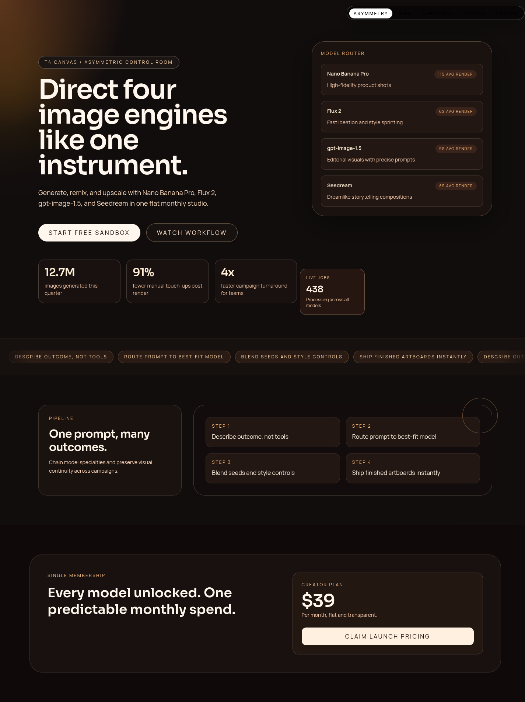
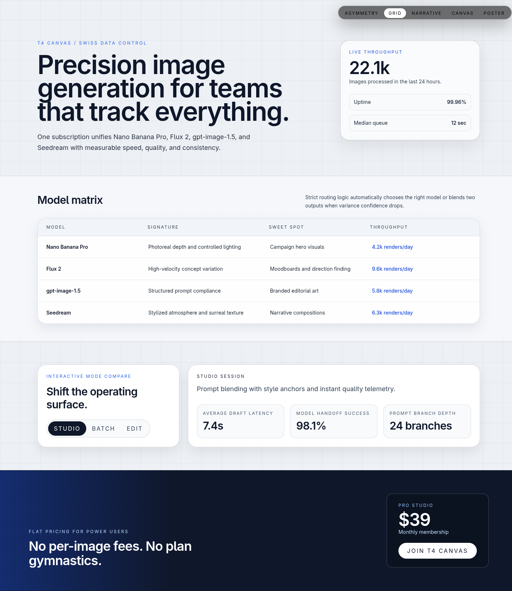
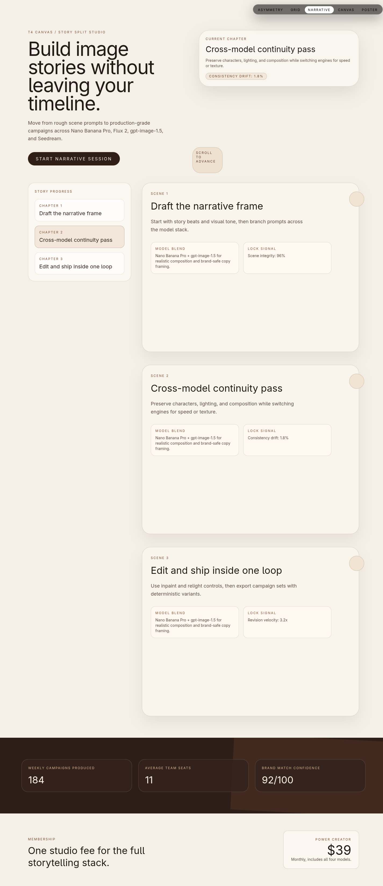

# Version 7

## Experiment Topology

horizontal

## Isolation Mode

isolated-fresh-app

## Hypothesis

Enforcing a strong spatial thesis per route should improve compositional intentionality and reduce safe, centered layouts.

## Mutation Axis

Spatial thesis

## Exact Skill Change

Added a version-specific spatial thesis gate requiring each route to commit to one spatial strategy with measurable composition checks and no thesis reuse.

## Expected Visual Delta

Stronger asymmetric tension, more memorable silhouettes, and clearer dense-to-breathing-zone contrast.

## Measured Result

Spatial-thesis forcing increased conceptual contrast but over-constrained execution, producing under-filled routes and large dead zones on multiple pages. Scored `9.0/20` (avg `0.90`), regression vs `version-6`.

## Keep / Drop

Drop as full mutation; salvage only selective asymmetric-composition checks.

## Screenshots

Responsive screenshots are stored under `screenshots/<route>/`.

### Route /1
- mobile: [screenshots/1/mobile.png](screenshots/1/mobile.png)
- tablet: [screenshots/1/tablet.png](screenshots/1/tablet.png)
- laptop: [screenshots/1/laptop.png](screenshots/1/laptop.png)

### Route /2
- mobile: [screenshots/2/mobile.png](screenshots/2/mobile.png)
- tablet: [screenshots/2/tablet.png](screenshots/2/tablet.png)
- laptop: [screenshots/2/laptop.png](screenshots/2/laptop.png)

### Route /3
- mobile: [screenshots/3/mobile.png](screenshots/3/mobile.png)
- tablet: [screenshots/3/tablet.png](screenshots/3/tablet.png)
- laptop: [screenshots/3/laptop.png](screenshots/3/laptop.png)

### Route /4
- mobile: [screenshots/4/mobile.png](screenshots/4/mobile.png)
- tablet: [screenshots/4/tablet.png](screenshots/4/tablet.png)
- laptop: [screenshots/4/laptop.png](screenshots/4/laptop.png)

### Route /5
- mobile: [screenshots/5/mobile.png](screenshots/5/mobile.png)
- tablet: [screenshots/5/tablet.png](screenshots/5/tablet.png)
- laptop: [screenshots/5/laptop.png](screenshots/5/laptop.png)

