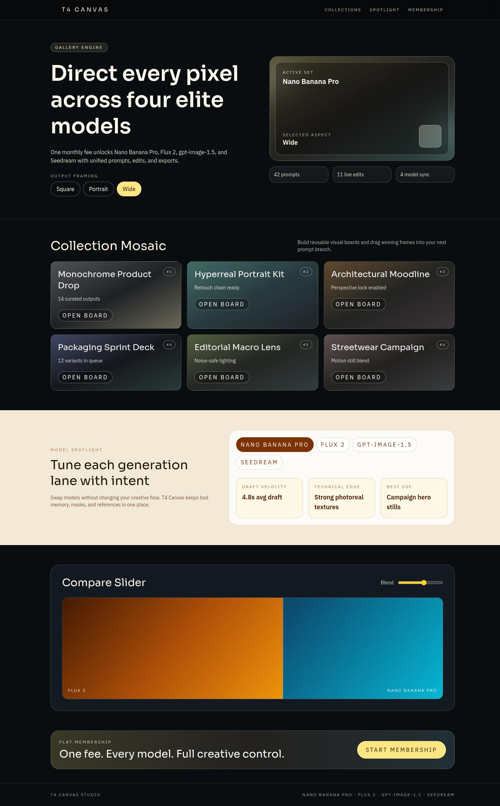
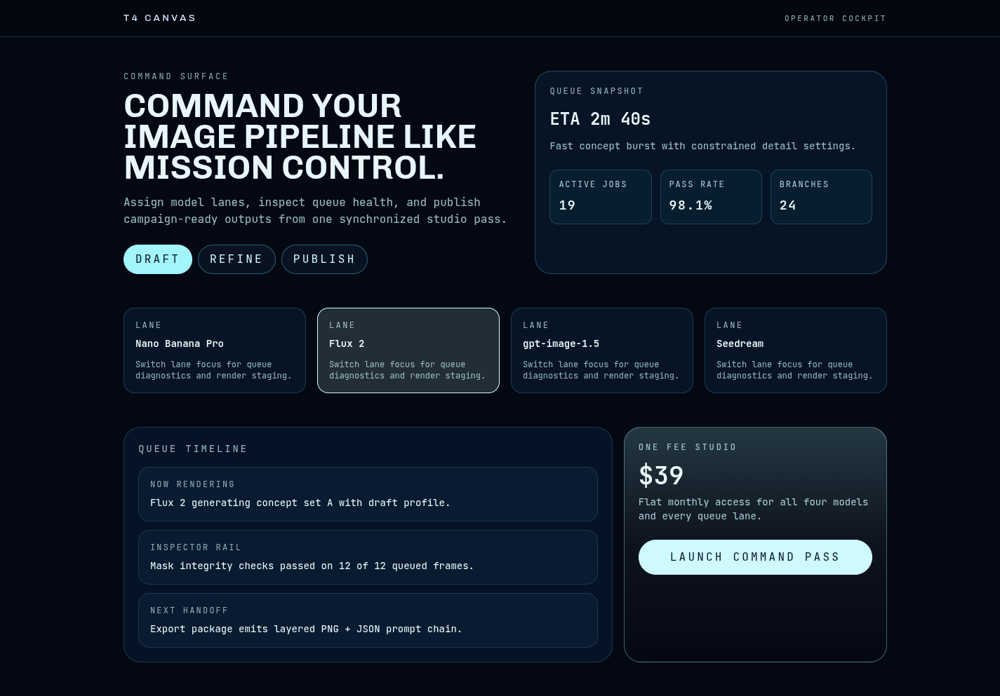
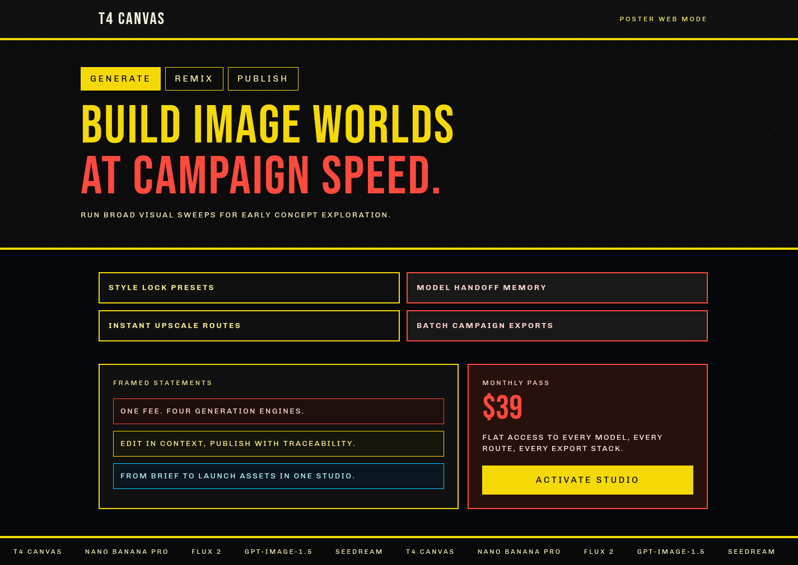

# Version 9

## Experiment Topology

vertical

## Isolation Mode

isolated-fresh-app

## Hypothesis

Adding explicit interaction-depth gates should reduce static sections and improve perceived product quality through meaningful stateful UI behavior.

## Mutation Axis

Interaction depth

## Exact Skill Change

Added a version-specific interaction-depth gate with a fixed route-to-interaction mapping, plus hard checks for first-fold interactivity, stateful mid-page modules, and non-ornamental controls.

## Expected Visual Delta

More routes should show active controls, content-changing toggles, and clearer motion/state feedback without sacrificing readability.

## Measured Result

Interaction-depth gates increased meaningful controls and stateful modules across all routes, improving perceived product realism and reducing static-page feel. Scored `15.0/20` (avg `1.50`), best of this loop.

## Keep / Drop

Keep as current best candidate.

## Screenshots

Responsive screenshots are stored under `screenshots/<route>/`.

### Route /1
- mobile: [screenshots/1/mobile.png](screenshots/1/mobile.png)
- tablet: [screenshots/1/tablet.png](screenshots/1/tablet.png)
- laptop: [screenshots/1/laptop.png](screenshots/1/laptop.png)

### Route /2
- mobile: [screenshots/2/mobile.png](screenshots/2/mobile.png)
- tablet: [screenshots/2/tablet.png](screenshots/2/tablet.png)
- laptop: [screenshots/2/laptop.png](screenshots/2/laptop.png)

### Route /3
- mobile: [screenshots/3/mobile.png](screenshots/3/mobile.png)
- tablet: [screenshots/3/tablet.png](screenshots/3/tablet.png)
- laptop: [screenshots/3/laptop.png](screenshots/3/laptop.png)

### Route /4
- mobile: [screenshots/4/mobile.png](screenshots/4/mobile.png)
- tablet: [screenshots/4/tablet.png](screenshots/4/tablet.png)
- laptop: [screenshots/4/laptop.png](screenshots/4/laptop.png)

### Route /5
- mobile: [screenshots/5/mobile.png](screenshots/5/mobile.png)
- tablet: [screenshots/5/tablet.png](screenshots/5/tablet.png)
- laptop: [screenshots/5/laptop.png](screenshots/5/laptop.png)

