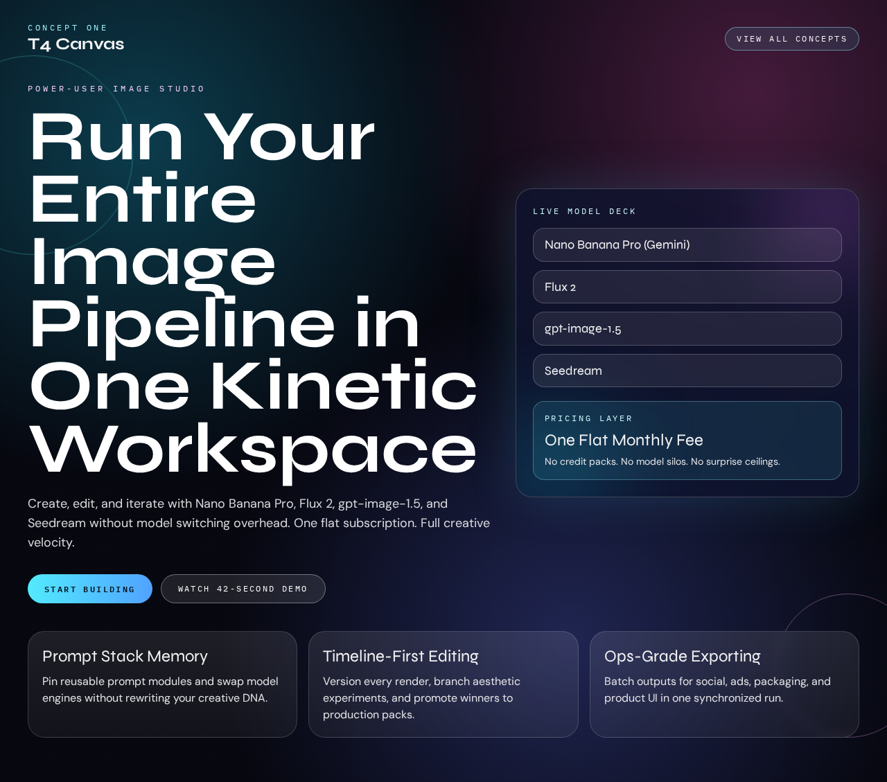
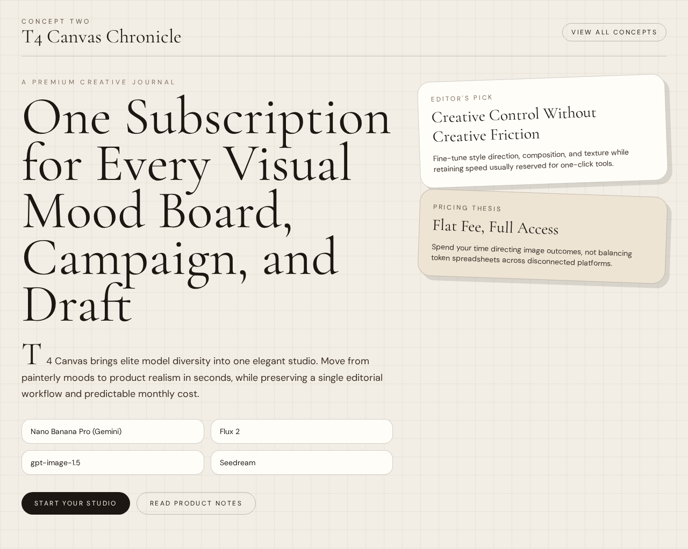
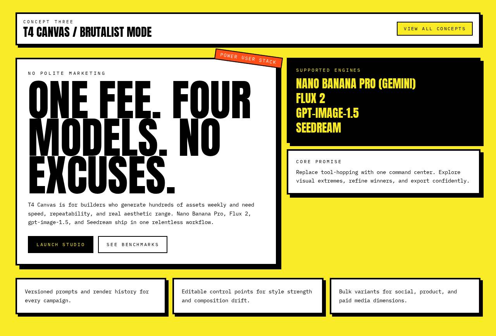
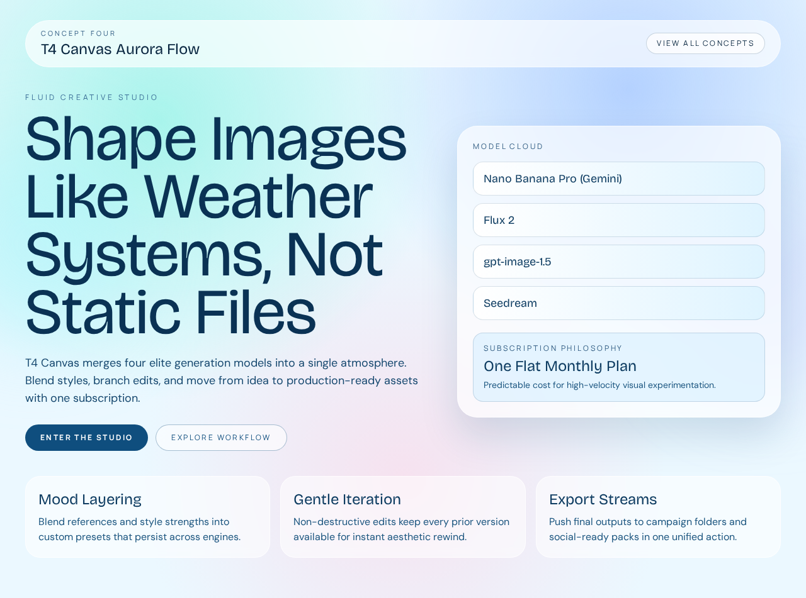
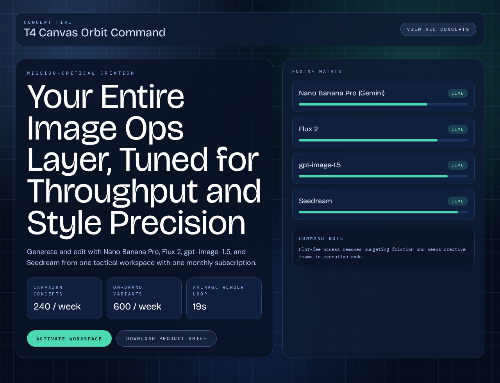

# Version 13

## Experiment Topology

fresh

## Isolation Mode

isolated-fresh-app

## Skill Baseline

global-frontend-skill

## Hypothesis

Adding explicit reliability and overflow quality gates will improve visual finish and mobile consistency without reducing route-level creativity.

## Mutation Axis

10. Reliability and overflow gates

## Exact Skill Change

Appended a new `Reliability and Overflow Gates` section in `SKILL.md` requiring viewport checks, overflow rejection, fixed/sticky overlap prevention, spacing-rhythm consistency, readable contrast/sizing, and visible interaction states.

## Expected Visual Delta

Cleaner full-page continuity, fewer clipped or overlapping elements, tighter spacing cadence, and improved readability on mobile.

## Measured Result

Rubric score: **11.8 / 20** (average **1.18 / 2**).

Dimension scores:
- Distinctiveness: 1.4
- Hero composition quality: 1.5
- Section rhythm and transitions: 0.7
- Typography craft: 1.5
- Text economy: 1.4
- Interaction quality: 0.8
- Visual finish: 1.3
- Accessibility and contrast: 1.2
- Mobile quality: 1.0
- Opus-target similarity: 1.0

Key observation: first-fold styling quality is decent, but route depth is too short and section rhythm is underdeveloped versus target references.

## Keep / Drop

Keep (seed baseline for this run; initial iteration has no prior in-run comparator). Next iteration will target section-graph depth and rhythm.

## Screenshots

Full-page screenshots for each route:

### Route /1

### Route /2

### Route /3

### Route /4

### Route /5

