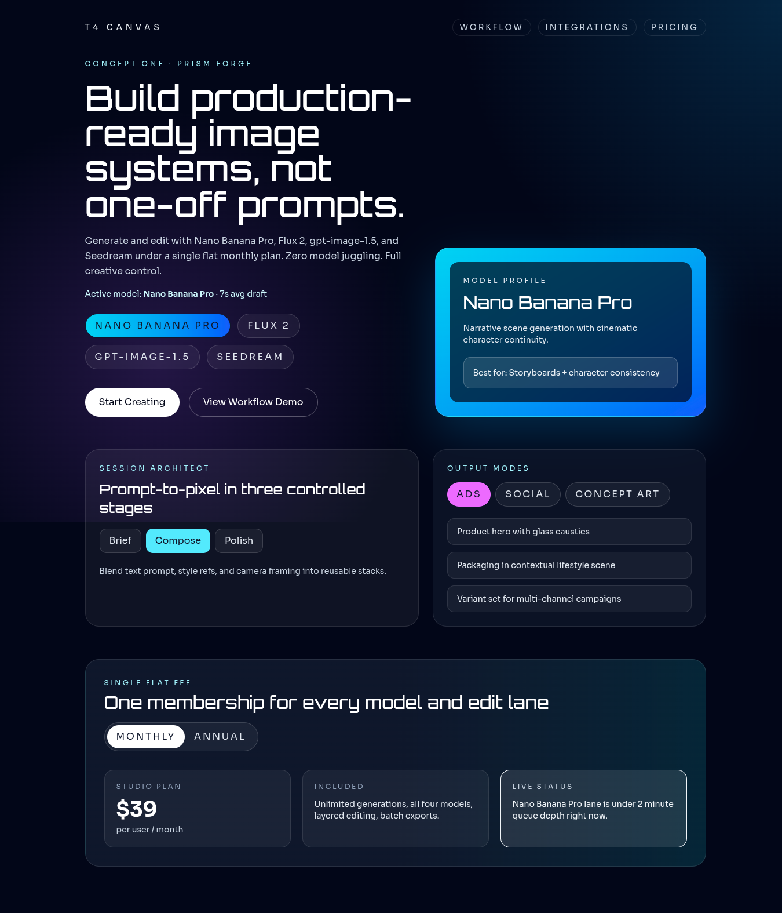
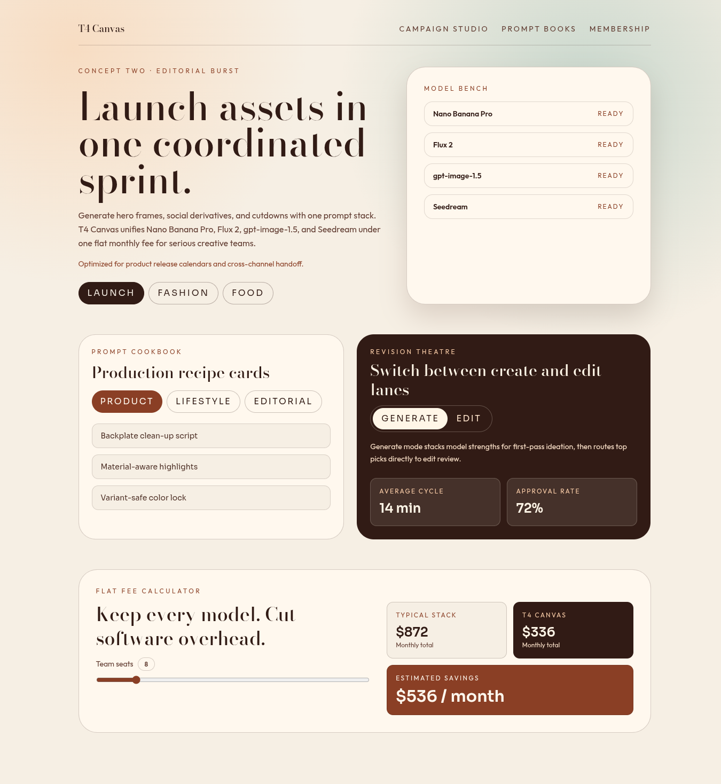
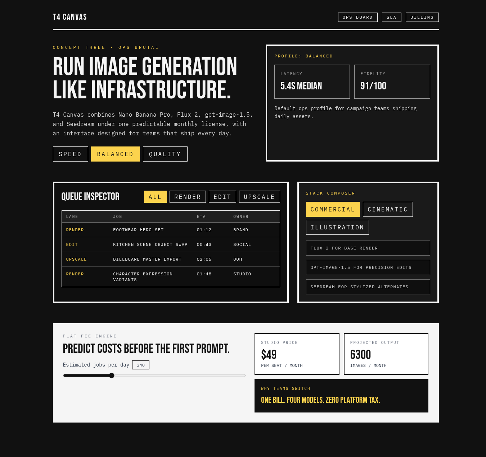
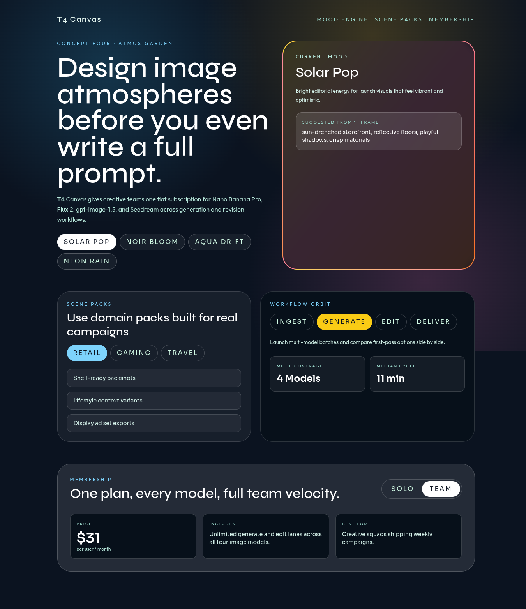
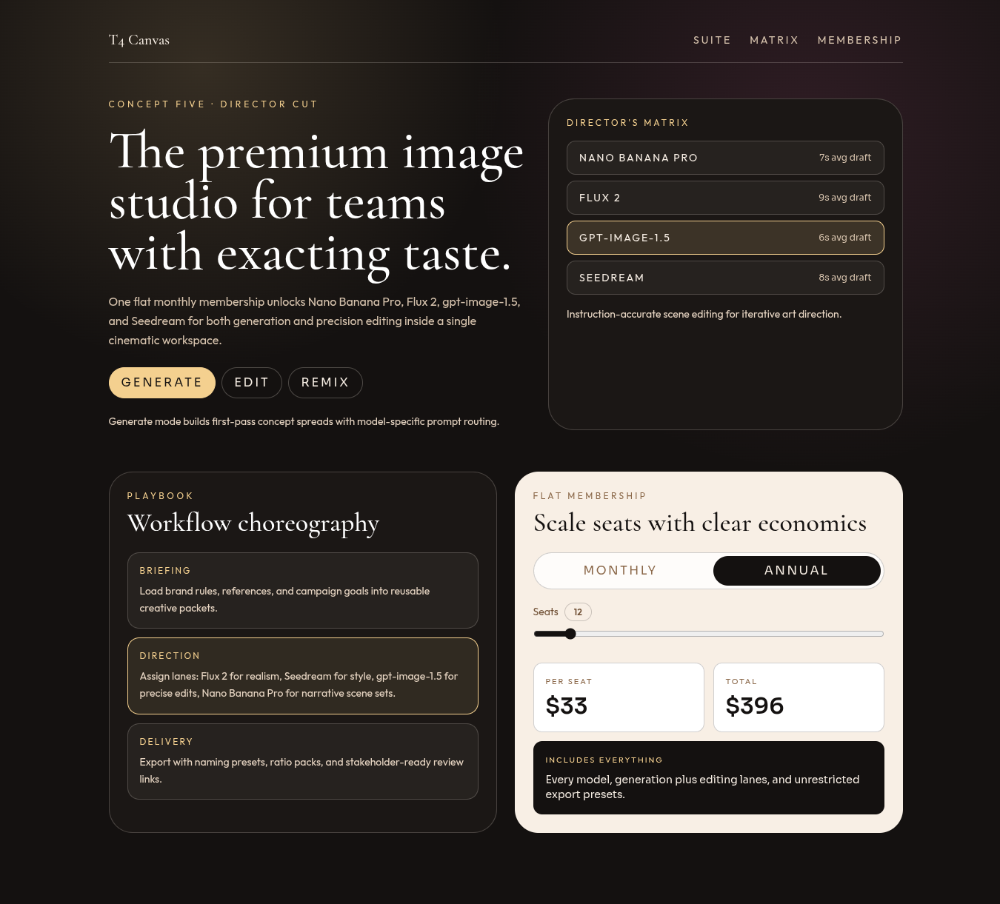

# Version 17

## Experiment Topology

vertical

## Isolation Mode

isolated-fresh-app

## Skill Baseline

previous-version-skill

## Hypothesis

Applying domain-specific copy pressure will improve text economy and product credibility by replacing generic marketing filler with concrete workflow language.

## Mutation Axis

8. Domain-specific copy pressure

## Exact Skill Change

Added `Domain-Specific Copy Pressure Guard` rules in `SKILL.md` to require concrete capability language, concise hero messaging, differentiated supporting labels, and rejection of generic SaaS phrasing.

## Expected Visual Delta

Sharper, more specific copy across hero and section modules with less repeated filler language and clearer product storytelling.

## Measured Result

Rubric score: **15.1 / 20** (average **1.51 / 2**), delta **+0.6** vs `version-16` (**14.5 / 20**).

Dimension scores:
- Distinctiveness: 1.8
- Hero composition quality: 1.7
- Section rhythm and transitions: 1.5
- Typography craft: 1.5
- Text economy: 1.7
- Interaction quality: 1.5
- Visual finish: 1.5
- Accessibility and contrast: 1.3
- Mobile quality: 1.2
- Opus-target similarity: 1.4

Outcome summary: copy pressure produced cleaner, more product-specific language and reduced generic filler across all routes while preserving concept variety.

## Keep / Drop

Keep. Score improved and portability gate passed (no banned markers or benchmark/process leakage in `SKILL.md`).

## Screenshots

Full-page screenshots for each route:

### Route /1

### Route /2

### Route /3

### Route /4

### Route /5

