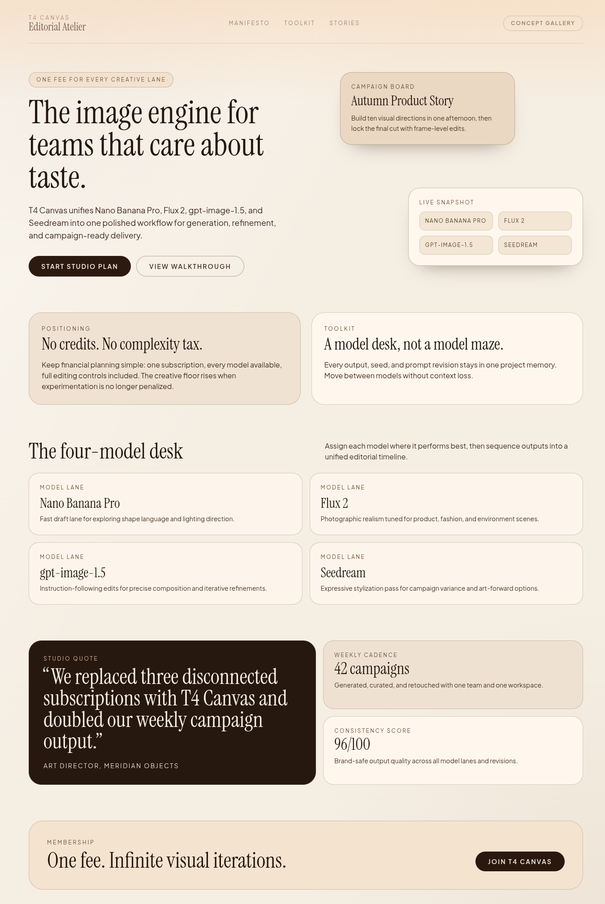
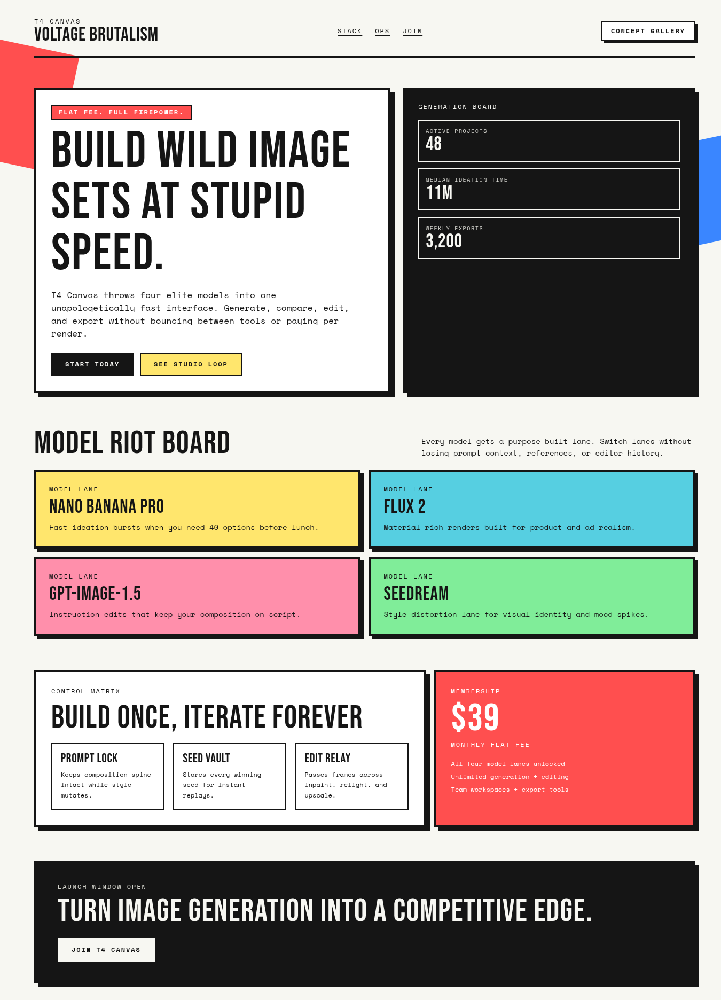
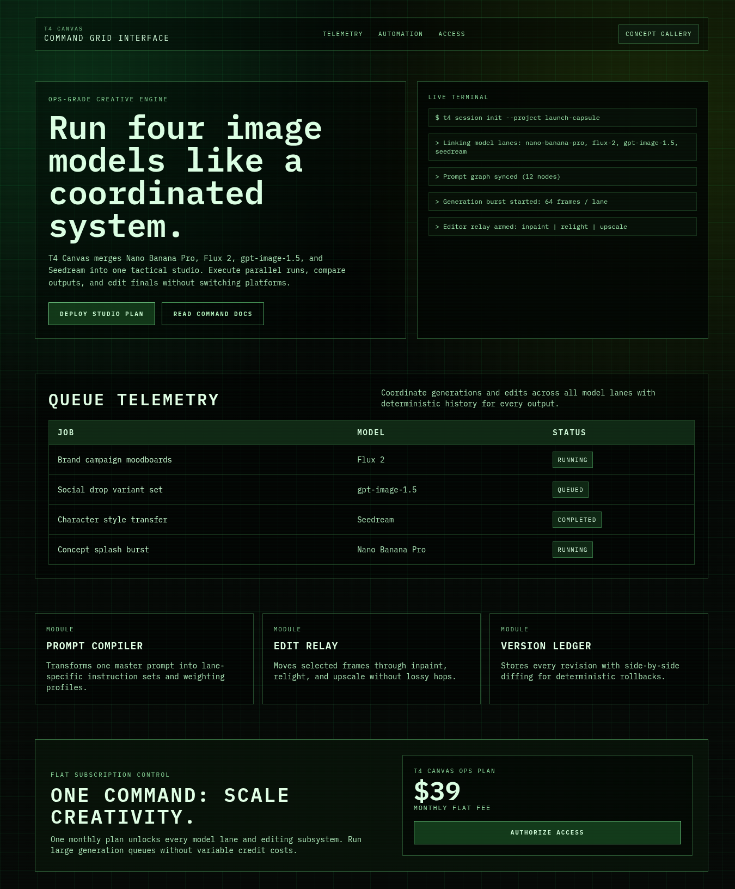
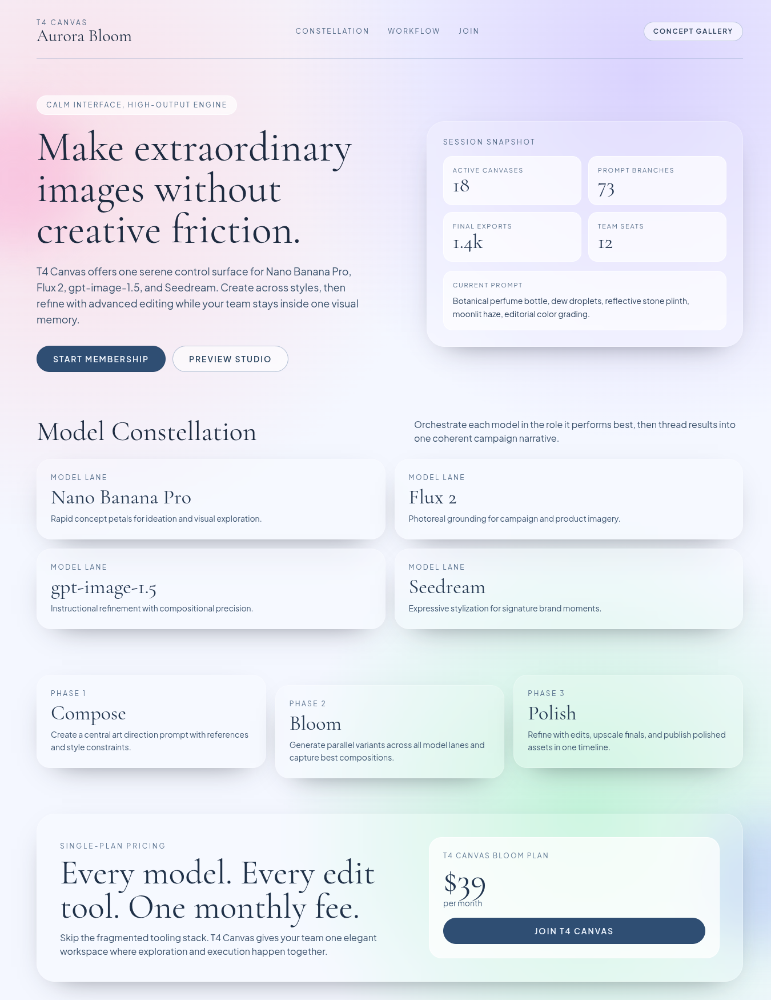

# Version 18

## Experiment Topology

vertical

## Isolation Mode

isolated-fresh-app

## Skill Baseline

previous-version-skill

## Hypothesis

Adding an explicit information pacing and breathing-space guard will reduce cognitive load, improve first-scan clarity, and preserve the cleaner minimal feel seen in version-15 while avoiding sparse dead zones.

## Mutation Axis

4. Spatial thesis (information pacing + breathing space)

## Exact Skill Change

Added `Information Pacing and Breathing Space Guard` rules in `SKILL.md` to enforce one-primary-idea sections, above-the-fold cluster caps, concise support copy, intentional negative space, and motion restraint for minimal/editorial directions.

## Expected Visual Delta

Cleaner hierarchy with less text crowding per section, clearer first impression, and improved scanability without reverting to empty placeholder bands.

## Measured Result

Rubric score: **15.0 / 20** (average **1.50 / 2**), delta **+1.1** vs `version-15` (**13.9 / 20**).

Dimension scores:
- Distinctiveness: 1.8
- Hero composition quality: 1.7
- Section rhythm and transitions: 1.6
- Typography craft: 1.6
- Text economy: 1.7
- Interaction quality: 1.1
- Visual finish: 1.6
- Accessibility and contrast: 1.3
- Mobile quality: 1.2
- Opus-target similarity: 1.4

Outcome summary: information pacing and breathing-space guidance improved scanability and section clarity across most routes while keeping strong visual identity diversity.

## Keep / Drop

Keep. Score improved and portability gate passed (no banned markers or benchmark/process leakage in `SKILL.md`).

## Screenshots

Full-page screenshots for each route:

### Route /1

### Route /2

### Route /3

### Route /4

### Route /5

