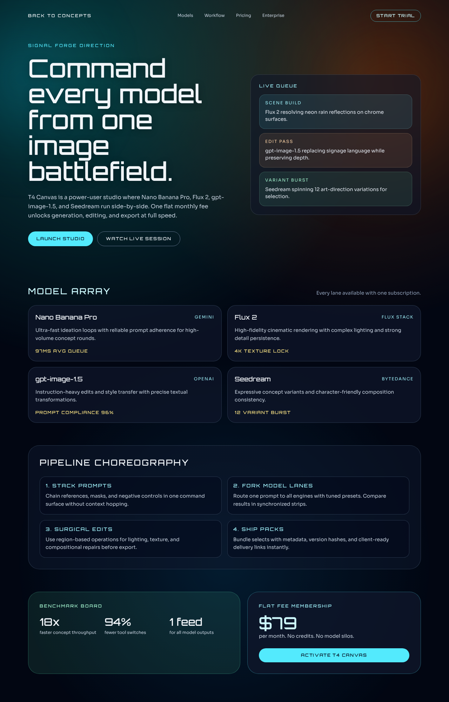
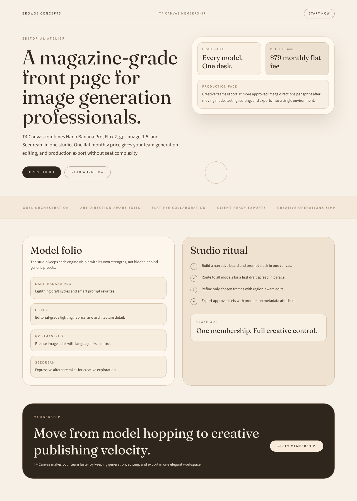
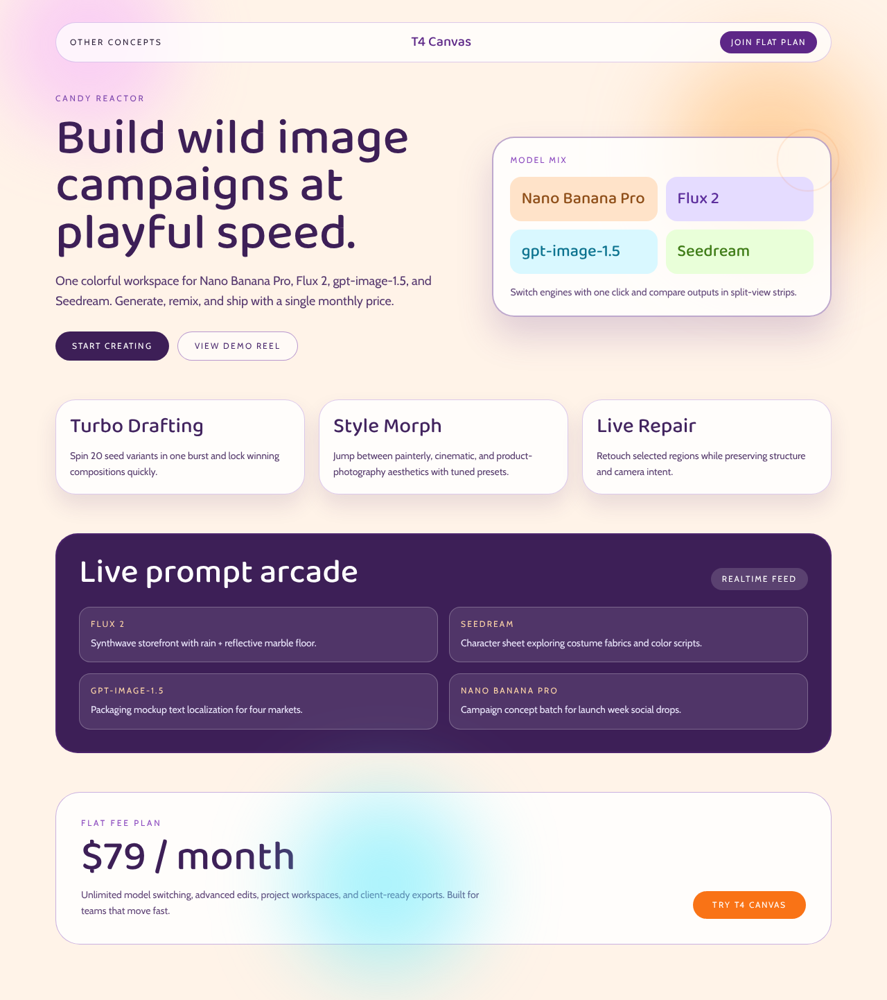
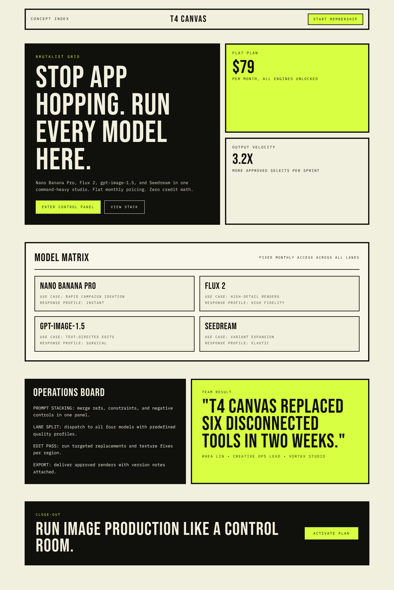

# Version 19

## Experiment Topology

vertical

## Isolation Mode

isolated-fresh-app

## Skill Baseline

previous-version-skill

## Hypothesis

Adding explicit anti-repetition rules for typography archetypes and contrast intent will reduce recurring default visual signatures (same font rhythm, same high-contrast palette behavior) and increase cross-concept differentiation without sacrificing clarity.

## Mutation Axis

Axis: 7 (`Anti-repetition guards`)

## Exact Skill Change

- Updated color guidance to require intentional contrast selection (soft tonal, balanced, or high-contrast) rather than default intensity.
- Added anti-repetition constraint to avoid repeating the same hero macro-pattern across concept sets.
- Added `Typography and Contrast De-Repetition Guard` with explicit pass/fail rules:
  - distinct typography archetype per concept in multi-concept outputs
  - cap repeated headline/body font pairings
  - vary weight rhythm across concepts
  - define per-concept contrast intent
  - restrain accent usage
  - prioritize hierarchy via tone/spacing/scale before heavy effects
  - run final divergence check and rework interchangeable concepts

## Expected Visual Delta

- More variation in font families and weight hierarchies across concepts.
- Fewer repeated neon/high-contrast defaults; better use of soft and balanced palettes when appropriate.
- Reduced “same-design-different-color” feel across generated routes.

## Measured Result

Rubric score: **15.3 / 20** (average **1.53 / 2**), delta **+0.3** vs `version-18` (**15.0 / 20**).

Dimension scores:
- Distinctiveness: 1.9
- Hero composition quality: 1.7
- Section rhythm and transitions: 1.6
- Typography craft: 1.7
- Text economy: 1.7
- Interaction quality: 1.1
- Visual finish: 1.6
- Accessibility and contrast: 1.3
- Mobile quality: 1.2
- Opus-target similarity: 1.5

Outcome summary: explicit style de-repetition rules increased cross-concept differentiation in type and palette strategy (including softer tonal treatments) while preserving structure and readability.

## Keep / Drop

Keep. Net score improved and portability gate passed (no banned markers or benchmark-process wording in `SKILL.md`).

## Screenshots

Full-page screenshots for each route:

### Route /1

### Route /2

### Route /3

### Route /4

### Route /5

