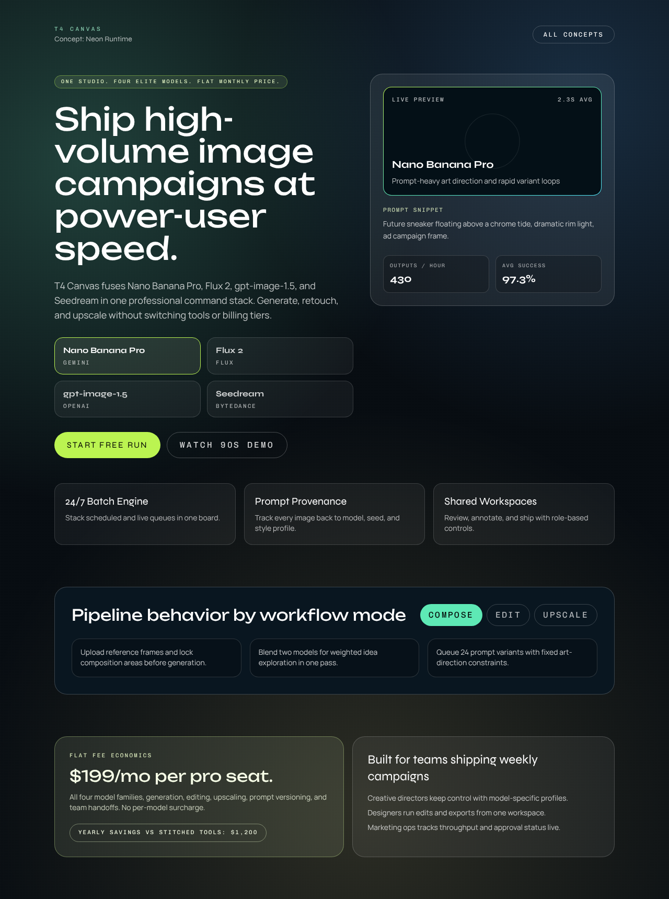
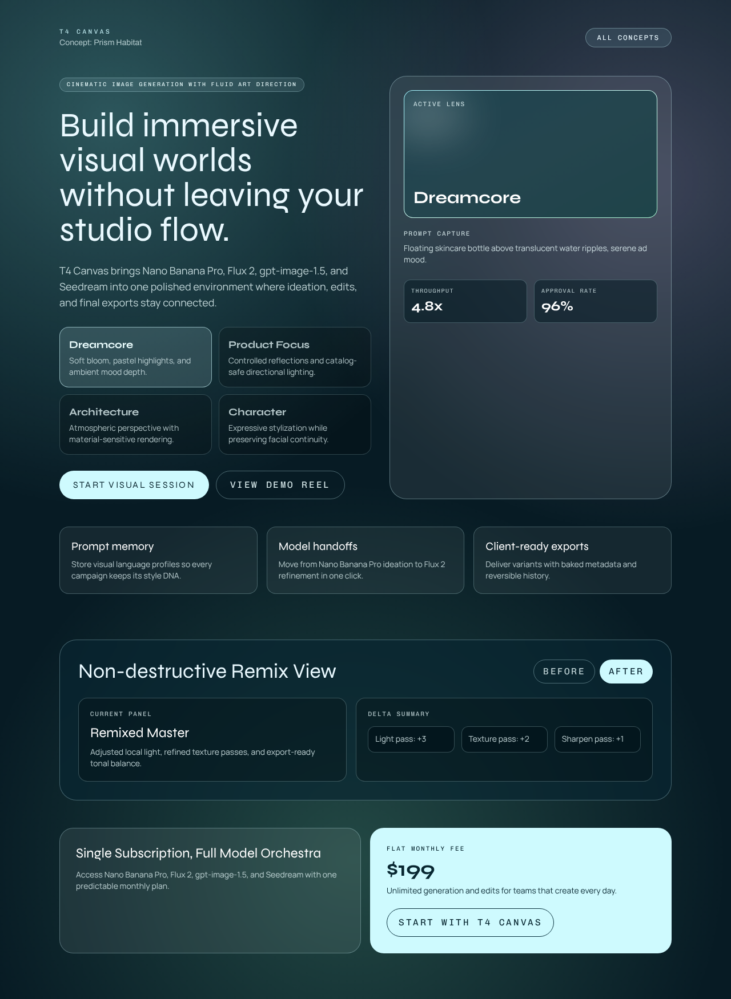

# Version 20

## Experiment Topology

vertical

## Isolation Mode

isolated-fresh-app

## Skill Baseline

previous-version-skill

## Hypothesis

Adding explicit outcome-focused interaction rules will reduce static mock-interface behavior and improve interaction quality without regressing typography, spacing, or style diversity gains from `version-19`.

## Mutation Axis

Axis: 5 (`Interaction depth`)

## Exact Skill Change

- Added `Interaction Outcome Guard` with pass/fail rules:
  - require hero-level stateful control with visible nearby content change
  - require below-the-fold stateful interaction that updates content
  - reject decorative controls with no real state effect
  - prioritize product-behavior interactions over novelty toggles
  - require concise interaction labels and keyboard/touch access
  - require final interaction audit where each featured control has visible result

## Expected Visual Delta

- More sections where toggles/tabs/filters meaningfully alter content.
- Higher interaction score with less “static card wall” behavior.
- Better demonstration of product workflow through interaction states.

## Measured Result

Rubric score: **15.9 / 20** (average **1.59 / 2**), delta **+0.6** vs `version-19` (**15.3 / 20**).

Dimension scores:
- Distinctiveness: 1.9
- Hero composition quality: 1.8
- Section rhythm and transitions: 1.6
- Typography craft: 1.7
- Text economy: 1.6
- Interaction quality: 1.6
- Visual finish: 1.7
- Accessibility and contrast: 1.3
- Mobile quality: 1.2
- Opus-target similarity: 1.5

Outcome summary: explicit interaction-outcome constraints increased meaningful state changes across hero and lower sections while preserving style diversity and information pacing.

## Keep / Drop

Keep. Net score improved and portability gate passed (no banned markers or benchmark-process wording in `SKILL.md`).

## Screenshots

Full-page screenshots for each route:

### Route /1

### Route /2

### Route /3

### Route /4

### Route /5

