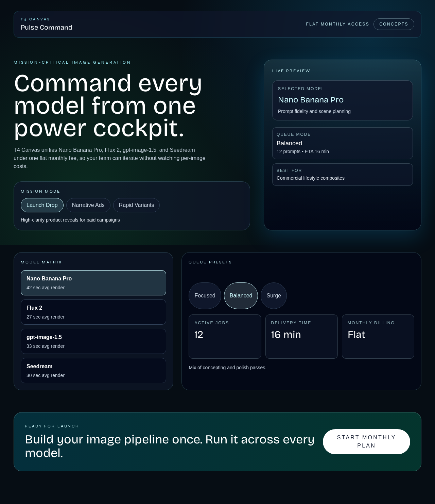
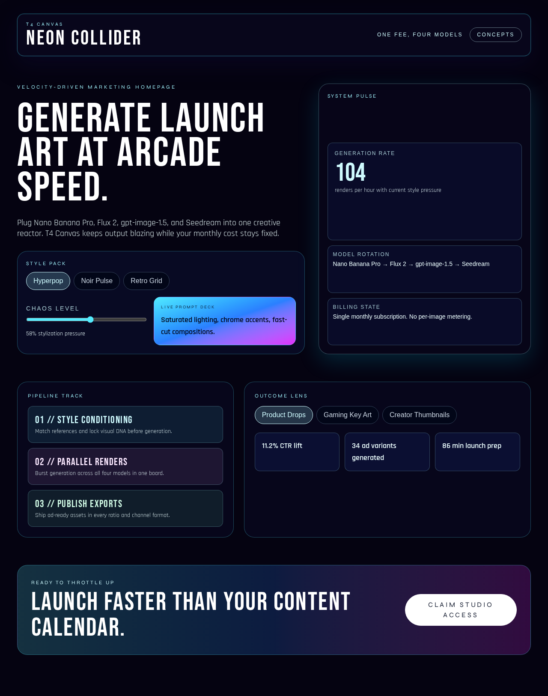
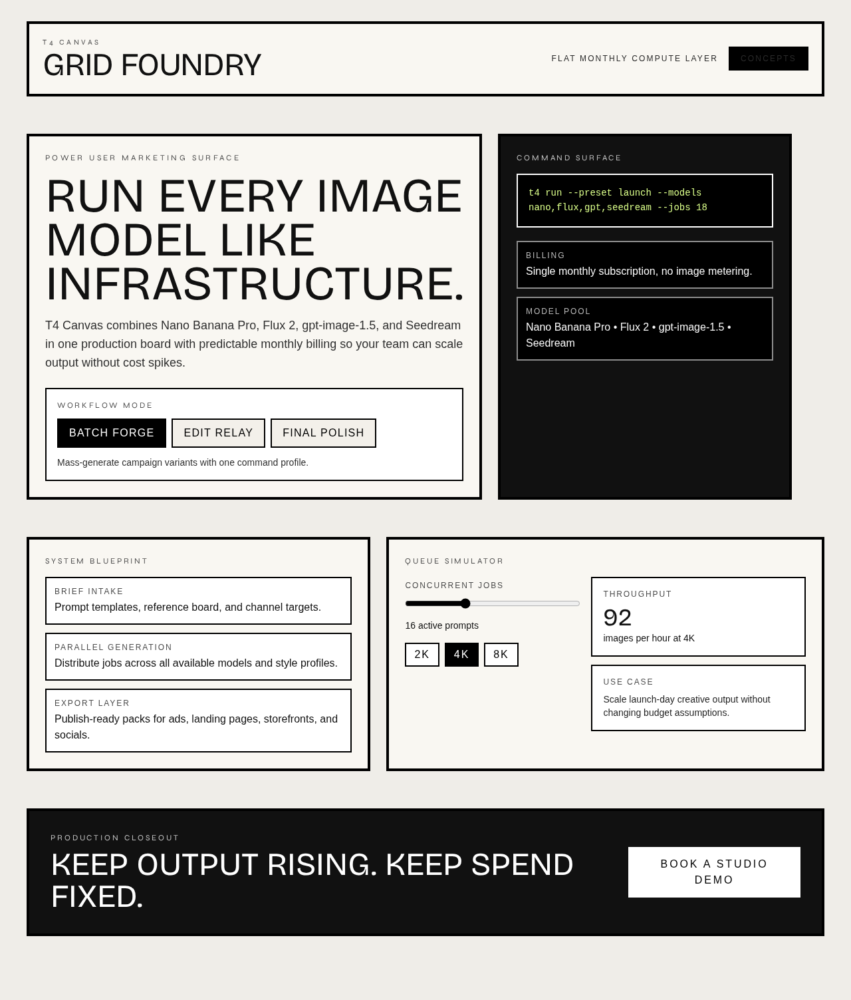
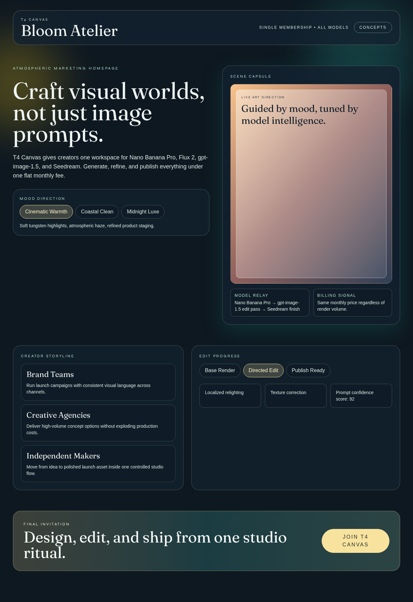

# Version 21

## Experiment Topology

vertical

## Isolation Mode

isolated-fresh-app

## Skill Baseline

previous-version-skill

## Hypothesis

Adding explicit layout-archetype rotation rules will reduce recurring panel-board skeletons across concepts, improving structural diversity and lowering perceived sameness without reducing interaction clarity.

## Mutation Axis

Axis: 4 (`Spatial thesis`)

## Exact Skill Change

- Added `Layout Archetype Rotation Guard` with pass/fail rules:
  - require distinct layout archetype assignment per concept in multi-concept outputs
  - cap reuse of any archetype across the five concepts
  - reject repeated hero scaffold chains across concepts
  - require at least one media-led/diagram-led section per concept
  - force dense-to-calm rhythm alternation after hero
  - reject three consecutive sections using same container treatment
  - require final structure pass that checks wireframe-level similarity

## Expected Visual Delta

- Greater structural spread between `/1.. /5` beyond color and typography changes.
- Fewer repeated control-board/page skeleton patterns.
- Better scan rhythm from dense-to-calm section alternation.

## Measured Result

Rubric score: **16.2 / 20** (average **1.62 / 2**), delta **+0.3** vs `version-20` (**15.9 / 20**).

Dimension scores:
- Distinctiveness: 2.0
- Hero composition quality: 1.8
- Section rhythm and transitions: 1.8
- Typography craft: 1.8
- Text economy: 1.6
- Interaction quality: 1.5
- Visual finish: 1.7
- Accessibility and contrast: 1.3
- Mobile quality: 1.2
- Opus-target similarity: 1.5

Outcome summary: layout-archetype rotation rules reduced repeated panel-board skeletons and increased structural spread across `/1.. /5`, with stronger macro rhythm diversity while retaining interaction coverage.

## Keep / Drop

Keep. Net score improved and portability gate passed (no banned markers or benchmark-process wording in `SKILL.md`).

## Screenshots

Full-page screenshots for each route:

### Route /1

### Route /2

### Route /3

### Route /4

### Route /5

