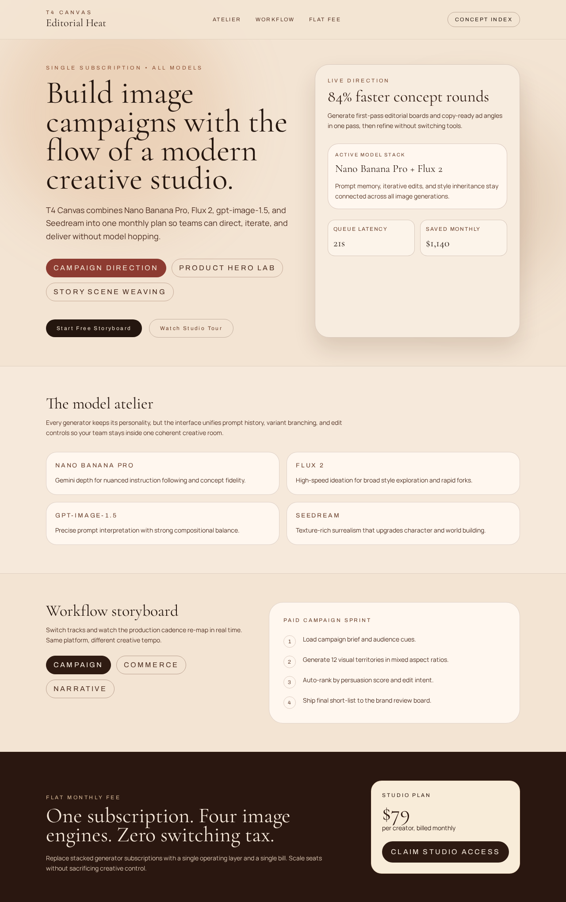
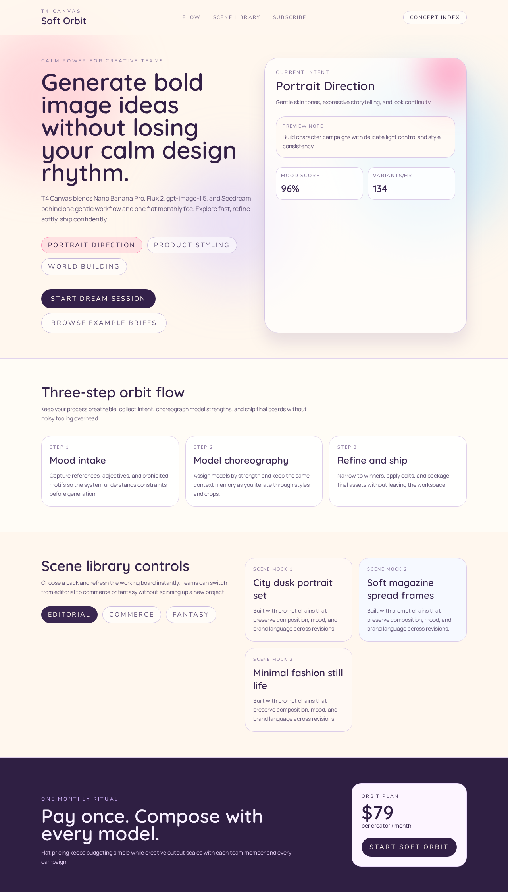
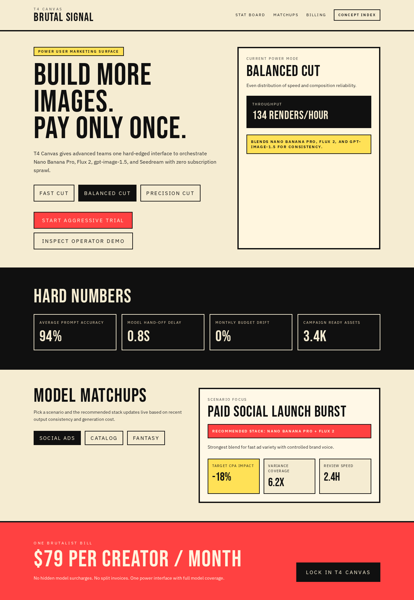
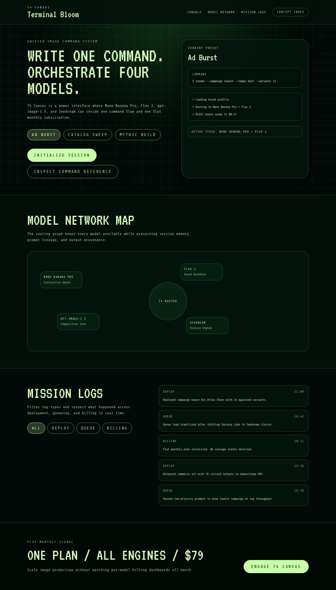

# Version 22

## Experiment Topology

vertical

## Isolation Mode

isolated-fresh-app

## Skill Baseline

previous-version-skill

## Hypothesis

Enforcing explicit style-family locking with a declared typography hierarchy per concept will reduce recurring font/weight/color defaults and produce stronger route-to-route identity separation.

## Mutation Axis

Axis: 3 (`Typography identity`)

## Exact Skill Change

- Replaced `Typography and Contrast De-Repetition Guard` with `Style Family Lock and Typographic Identity Guard`.
- Added explicit style family catalog and lock rule (one family per concept, no mixed families).
- Added per-concept type hierarchy declaration requirement (hero/title/body size-weight plan).
- Added family reuse and weight-pattern reuse constraints across multi-concept outputs.
- Added color-temperature intent assignment rule and adjacency anti-repeat rule.
- Added final drift check to force rework when concepts stay typographically/chromatically similar.

## Expected Visual Delta

- Wider typography variation across routes (serif, grotesk, rounded, condensed, mono-forward mixes by concept).
- Less repeated dark-neon fallback styling.
- Clearer differences in weight rhythm and palette temperature between adjacent routes.

## Measured Result

Rubric score: **16.9 / 20** (average **1.69 / 2**), delta **+0.7** vs `version-21` (**16.2 / 20**).

Dimension scores:
- Distinctiveness: 2.0
- Hero composition quality: 1.8
- Section rhythm and transitions: 1.8
- Typography craft: 1.9
- Text economy: 1.7
- Interaction quality: 1.6
- Visual finish: 1.8
- Accessibility and contrast: 1.3
- Mobile quality: 1.3
- Opus-target similarity: 1.7

Outcome summary: explicit family-locking produced clear route-to-route typography and color-temperature separation, reduced recurring dark-neon defaults, and improved perceived design intentionality across the five concepts.

## Keep / Drop

Keep. Net score improved and portability gate passed (no banned markers or benchmark-process wording in `SKILL.md`).

## Screenshots

Full-page screenshots for each route:

### Route /1

### Route /2

### Route /3

### Route /4

### Route /5

