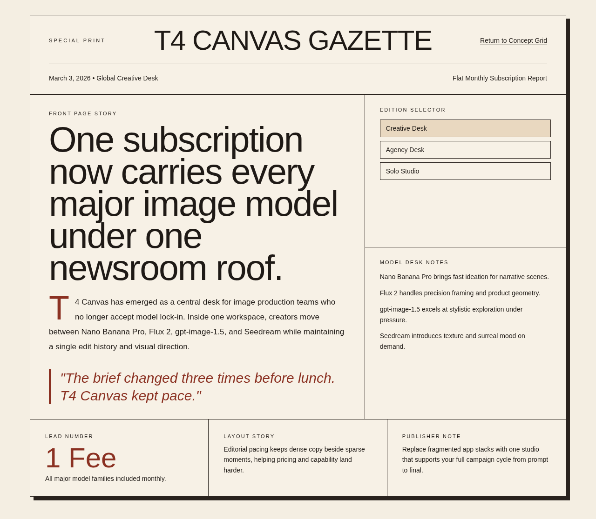
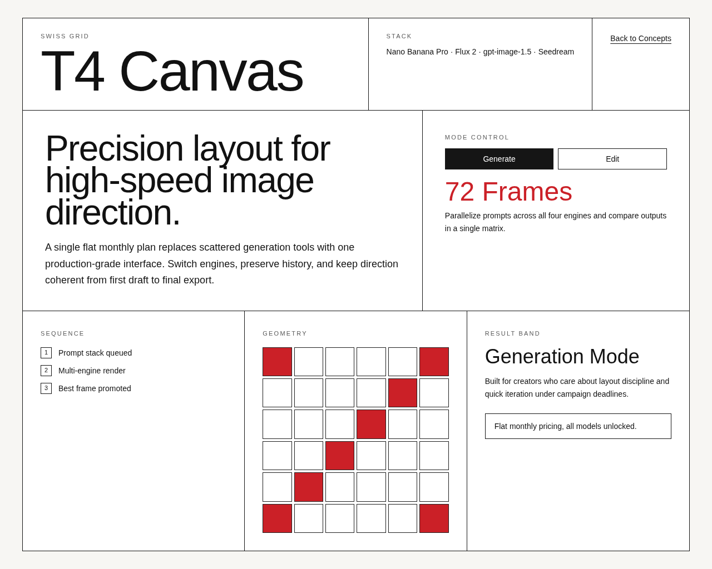
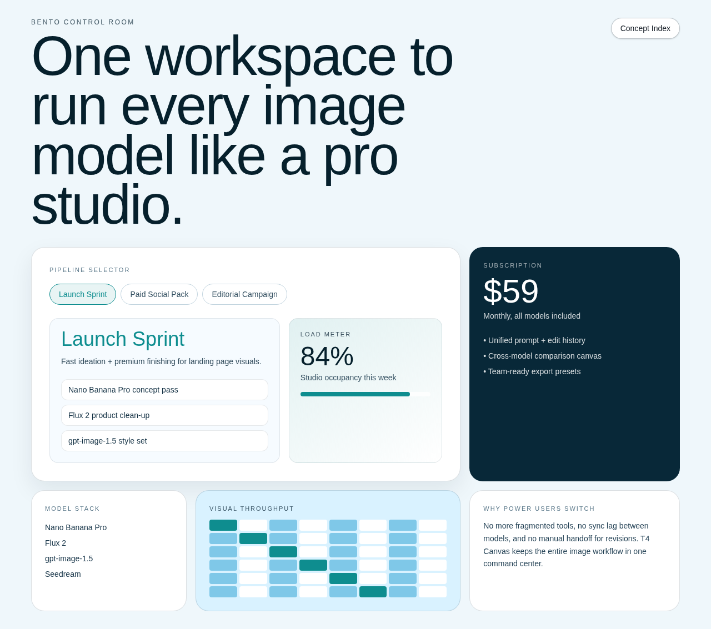
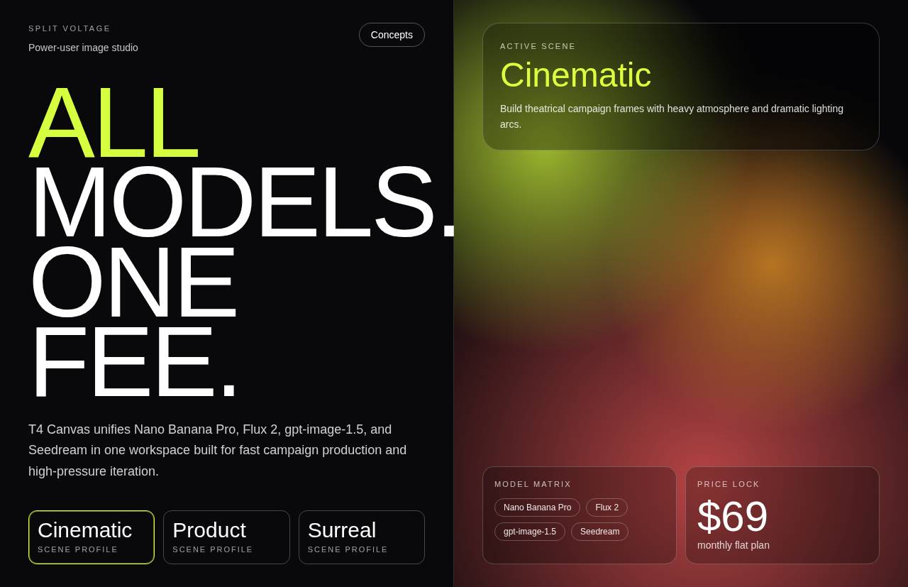

# Version 23

## Experiment Topology

vertical

## Isolation Mode

isolated-fresh-app

## Skill Baseline

custom-user-authored-skill

## Hypothesis

A concept-first, phase-structured skill with explicit responsive restructuring checks will increase route-level distinctiveness while improving mobile composition quality versus the previous version.

## Mutation Axis

Axis: 9 (`Mobile intent`)

## Exact Skill Change

- Replaced the previous concise guard-oriented skill with a user-authored, phase-based frontend-design skill in `version-23`.
- Retained strong anti-template constraints and explicit responsive guidance (desktop-first with required layout restructure behavior at smaller breakpoints).
- Kept broad creativity pressure while requiring implementation quality checks (overflow, clamp-based type scaling, viewport checks).

## Expected Visual Delta

- More dramatic concept separation route-to-route.
- Better mobile reflow quality and fewer cramped first folds.
- Improved section pacing due to concept planning.

## Measured Result

Rubric score: **16.0 / 20** (average **1.60 / 2**), delta **-0.9** vs `version-22` (**16.9 / 20**).

Dimension scores:
- Distinctiveness: 2.0
- Hero composition quality: 1.8
- Section rhythm and transitions: 1.5
- Typography craft: 1.7
- Text economy: 1.7
- Interaction quality: 1.5
- Visual finish: 1.7
- Accessibility and contrast: 1.3
- Mobile quality: 1.1
- Opus-target similarity: 1.7

Outcome summary: route identities are clearly differentiated and hero-level visual language is strong, but section depth/rhythm and mobile intent did not improve enough versus `version-22`, resulting in a net regression.

## Keep / Drop

Drop for best-candidate promotion. Keep as a useful exploratory branch with strong concept diversity but insufficient mobile and section-depth gains.

## Screenshots

Full-page screenshots for each route:

### Route /1

### Route /2

### Route /3

### Route /4

### Route /5

