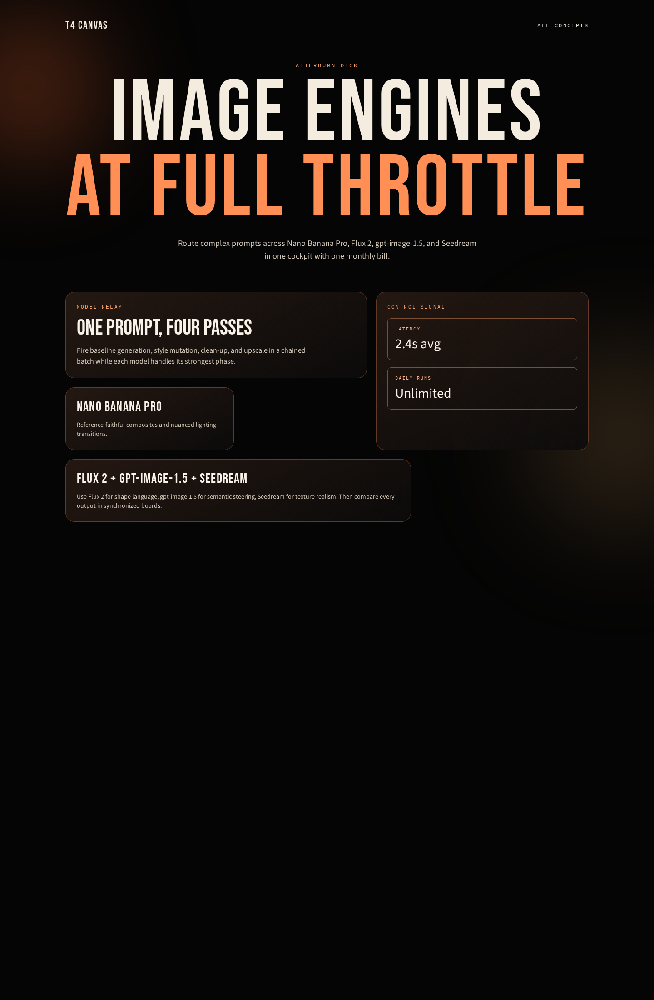
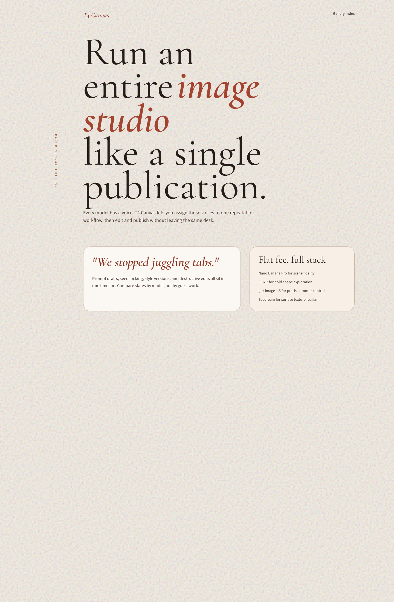
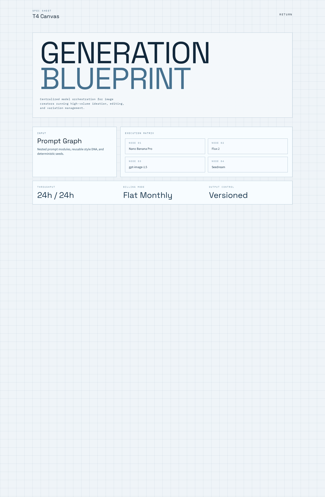
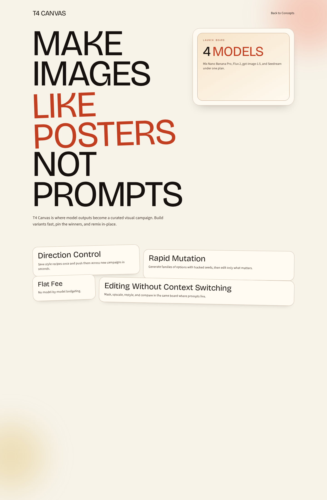
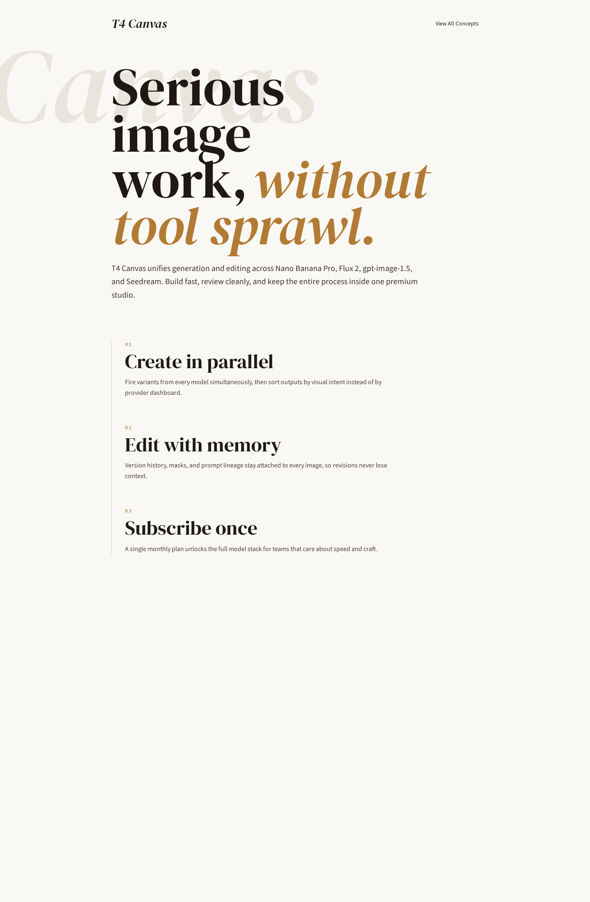

# Version 24

## Experiment Topology

vertical

## Isolation Mode

isolated-fresh-app

## Skill Baseline

custom-user-authored-skill

## Hypothesis

A stricter art-direction-first skill that explicitly bans default wireframes and pushes non-repetitive layout metaphors will improve section graph diversity and reduce first-fold-heavy outputs versus version 23.

## Mutation Axis

Axis: 2 (`Section graph diversity`)

## Exact Skill Change

- Replaced the previous phase-structured skill with a new art-director framing (`version-24` user-authored SKILL).
- Added explicit metaphor/screenshot/wrong-thing pre-commit decisions.
- Added stronger anti-default bans (hero template, repeated card rows, repeated tracked labels, default dark palettes).
- Increased pressure for distinct macro layout strategies and screenshot-worthy composition moments.

## Expected Visual Delta

- Deeper post-hero section structure with fewer short/top-heavy pages.
- More route-to-route wireframe divergence and stronger macro rhythm shifts.
- Better resistance to repeated AI-default composition patterns.

## Measured Result

Rubric score: **16.6 / 20** (average **1.66 / 2**), delta **+0.6** vs `version-23` (**16.0 / 20**), delta **-0.3** vs `version-22` (**16.9 / 20**).

Dimension scores:
- Distinctiveness: 2.0
- Hero composition quality: 1.9
- Section rhythm and transitions: 1.8
- Typography craft: 1.9
- Text economy: 1.8
- Interaction quality: 1.0
- Visual finish: 1.8
- Accessibility and contrast: 1.4
- Mobile quality: 1.2
- Opus-target similarity: 1.8

Outcome summary: layout and typographic diversity improved meaningfully and section graph depth recovered versus `version-23`, but weak stateful interaction depth and only moderate mobile/accessibility gains kept the version below the current best (`version-22`).

## Keep / Drop

Keep the mutation direction (positive recovery from `version-23`) but do not promote as best candidate yet.

## Screenshots

Full-page screenshots for each route:

### Route /1

### Route /2

### Route /3

### Route /4

### Route /5

