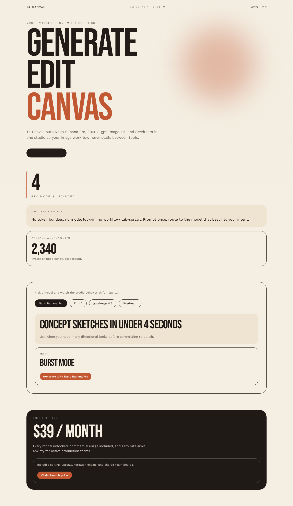
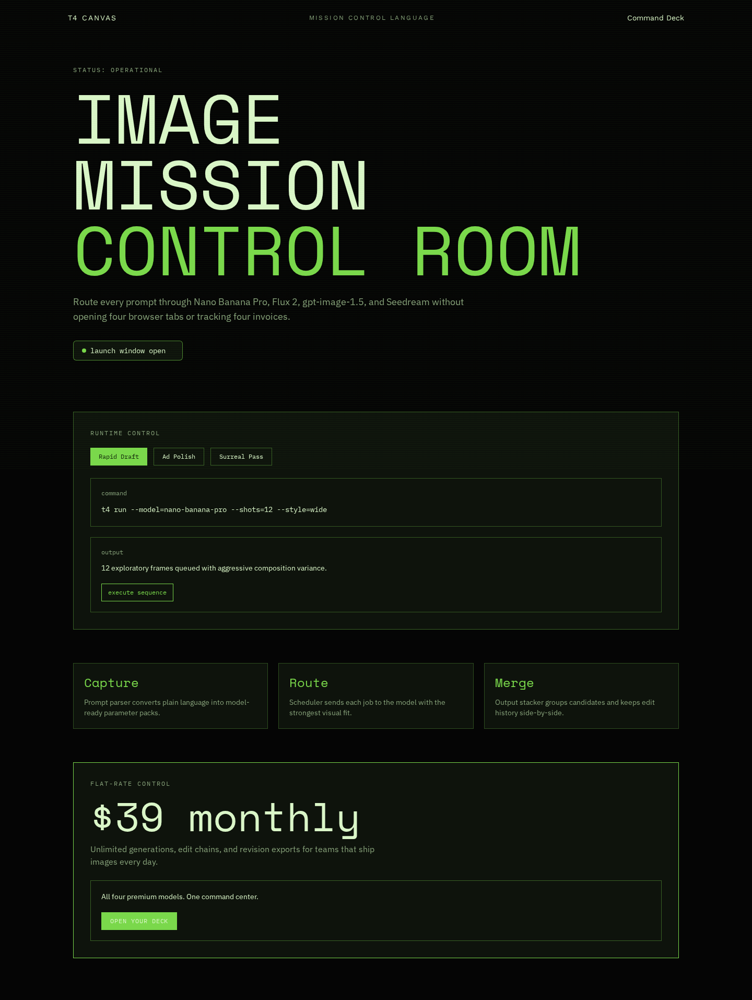
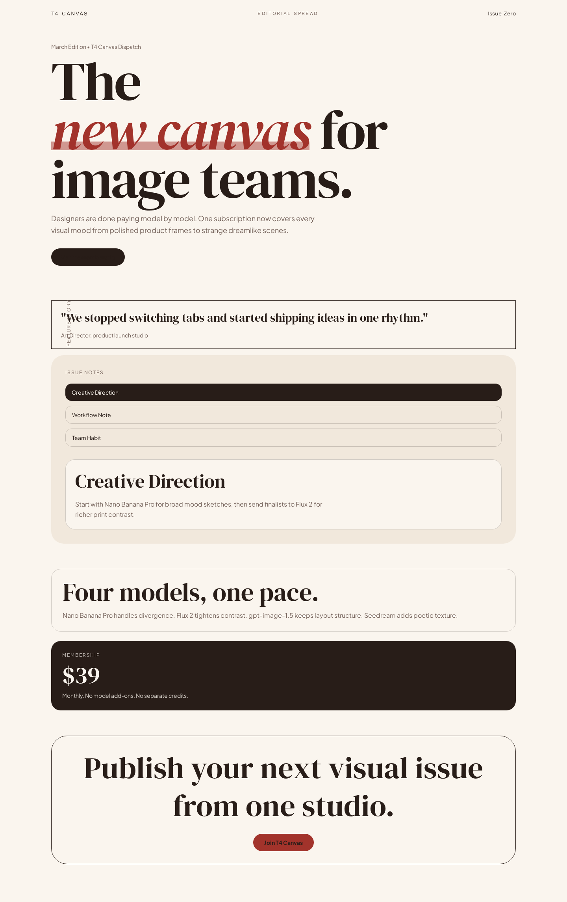
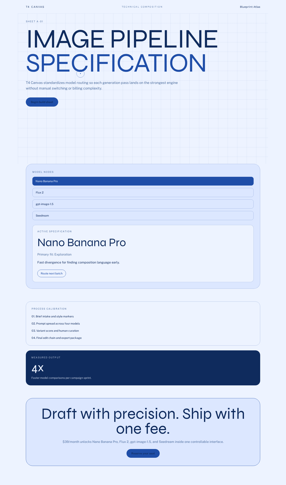
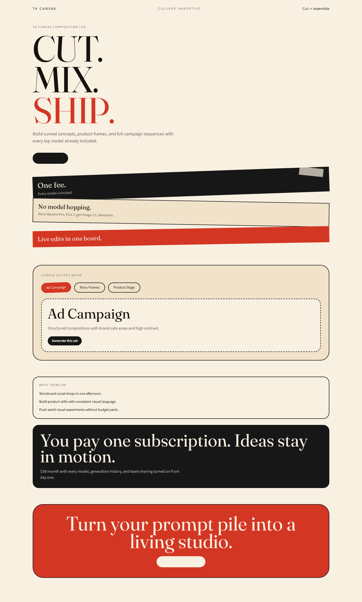

# Version 26

## Experiment Topology

vertical

## Isolation Mode

isolated-fresh-app

## Skill Baseline

previous-version-skill

## Hypothesis

Adding hard quantitative depth gates (minimum section count, required post-hero interaction/evidence/closing sections, and mobile overflow checks) will eliminate hero-only outputs and improve section rhythm versus version 25.

## Mutation Axis

Axis: 2 (`Section graph diversity`)

## Exact Skill Change

- Added `Phase 11: Depth Gates (Non-Negotiable)` with explicit structure requirements per route.
- Added section-count, post-hero interaction, and closing CTA constraints.
- Added mobile headline clipping guard for 375-390px widths.

## Expected Visual Delta

- Routes should extend beyond hero with at least three additional modules.
- Reduced first-fold-only compositions.
- Better mobile headline fit and lower text clipping risk.

## Measured Result

- Headless generation completed successfully via `artifacts/version-26-run-01` (attempt 1).
- Generated `t4-canvas` app includes routes `/`, `/1`, `/2`, `/3`, `/4`, `/5`.
- Validation in run artifacts: `bun run lint` and `bun run build` completed.
- Screenshot capture completed for `/1.. /5` across desktop/tablet/mobile (+ `laptop.png` alias).
- Dev server lifecycle verified: server stopped after capture and port `4000` is clear.
- Rubric score: **16.5 / 20** (average **1.65 / 2**), delta **+1.8** vs `version-25` (**14.7 / 20**), delta **-0.1** vs `version-24` (**16.6 / 20**).
- Outcome summary: section depth and mobile robustness recovered strongly from `version-25`; visual distinctiveness remained high.

## Keep / Drop

Keep this mutation direction (depth gates and overflow guards).

## Screenshots

Responsive full-page captures for routes `/1` to `/5`:

### Route /1

- Desktop: [screenshots/1/desktop.png](screenshots/1/desktop.png)
- Tablet: [screenshots/1/tablet.png](screenshots/1/tablet.png)
- Mobile: [screenshots/1/mobile.png](screenshots/1/mobile.png)
- Laptop alias: [screenshots/1/laptop.png](screenshots/1/laptop.png)

### Route /2

- Desktop: [screenshots/2/desktop.png](screenshots/2/desktop.png)
- Tablet: [screenshots/2/tablet.png](screenshots/2/tablet.png)
- Mobile: [screenshots/2/mobile.png](screenshots/2/mobile.png)
- Laptop alias: [screenshots/2/laptop.png](screenshots/2/laptop.png)

### Route /3

- Desktop: [screenshots/3/desktop.png](screenshots/3/desktop.png)
- Tablet: [screenshots/3/tablet.png](screenshots/3/tablet.png)
- Mobile: [screenshots/3/mobile.png](screenshots/3/mobile.png)
- Laptop alias: [screenshots/3/laptop.png](screenshots/3/laptop.png)

### Route /4

- Desktop: [screenshots/4/desktop.png](screenshots/4/desktop.png)
- Tablet: [screenshots/4/tablet.png](screenshots/4/tablet.png)
- Mobile: [screenshots/4/mobile.png](screenshots/4/mobile.png)
- Laptop alias: [screenshots/4/laptop.png](screenshots/4/laptop.png)

### Route /5

- Desktop: [screenshots/5/desktop.png](screenshots/5/desktop.png)
- Tablet: [screenshots/5/tablet.png](screenshots/5/tablet.png)
- Mobile: [screenshots/5/mobile.png](screenshots/5/mobile.png)
- Laptop alias: [screenshots/5/laptop.png](screenshots/5/laptop.png)

