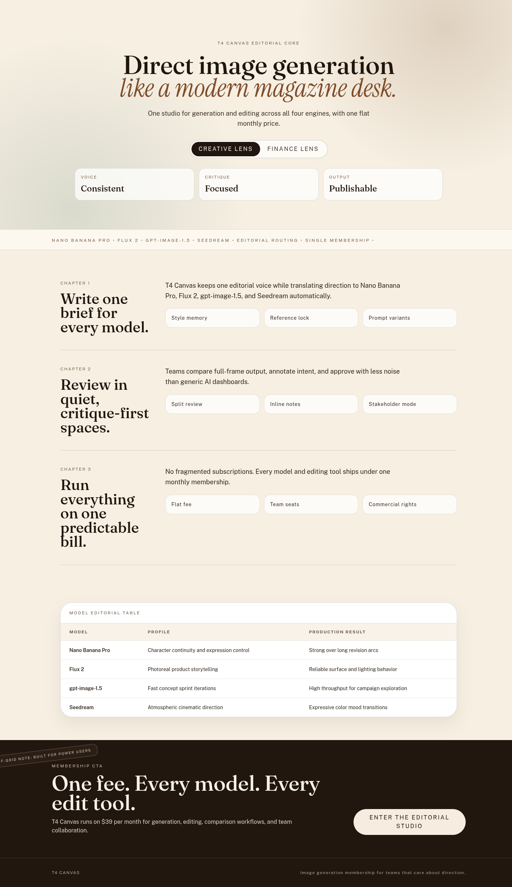

# Version 4

## Hypothesis

Enforcing a unique spatial thesis per route will improve composition divergence and reduce repeated container cadence, increasing distinctiveness and Opus-target similarity.

## Mutation Axis

Spatial thesis (`references/mutation_axes.md`, axis 4).

## Exact Skill Change

Edited only `experiments/version-4/.agents/skills/frontend-design/SKILL.md` under `## Composition Rules` to add:
- per-route spatial-thesis uniqueness constraints,
- mandatory section-width shifts,
- required off-grid anchor elements,
- a spatial audit gate for repeated hero silhouette/cadence.

## Expected Visual Delta

Stronger macro-layout divergence across routes and less repeated card-grid rhythm after the first fold.

## Measured Result

Compared against:
- `research/targetted-designs/`
- `research/theo-screenshots-2k-clean/opus45_with_skill/`
- `research/theo-screenshots-2k-clean/opus_iterations/`

Rubric summary:
- Previous (`version-3`) average: **1.44**
- `version-4` average: **1.49**
- Delta: **+0.05**

Spatial divergence improved, especially in `/1`, `/4`, and `/5`. Remaining weakness is copy density in `/2` and `/3`.

## Keep / Drop

Keep.

## Screenshots

Responsive screenshots are stored under `screenshots/<route>/`.

### Route /1
- mobile: [screenshots/1/mobile.png](screenshots/1/mobile.png)
- tablet: [screenshots/1/tablet.png](screenshots/1/tablet.png)
- laptop: [screenshots/1/laptop.png](screenshots/1/laptop.png)

### Route /2
- mobile: [screenshots/2/mobile.png](screenshots/2/mobile.png)
- tablet: [screenshots/2/tablet.png](screenshots/2/tablet.png)
- laptop: [screenshots/2/laptop.png](screenshots/2/laptop.png)

### Route /3
- mobile: [screenshots/3/mobile.png](screenshots/3/mobile.png)
- tablet: [screenshots/3/tablet.png](screenshots/3/tablet.png)
- laptop: [screenshots/3/laptop.png](screenshots/3/laptop.png)

### Route /4
- mobile: [screenshots/4/mobile.png](screenshots/4/mobile.png)
- tablet: [screenshots/4/tablet.png](screenshots/4/tablet.png)
- laptop: [screenshots/4/laptop.png](screenshots/4/laptop.png)

### Route /5
- mobile: [screenshots/5/mobile.png](screenshots/5/mobile.png)
- tablet: [screenshots/5/tablet.png](screenshots/5/tablet.png)
- laptop: [screenshots/5/laptop.png](screenshots/5/laptop.png)

