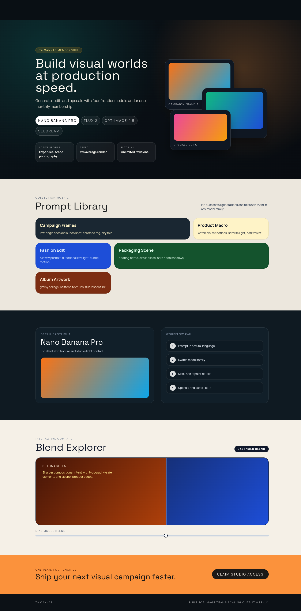
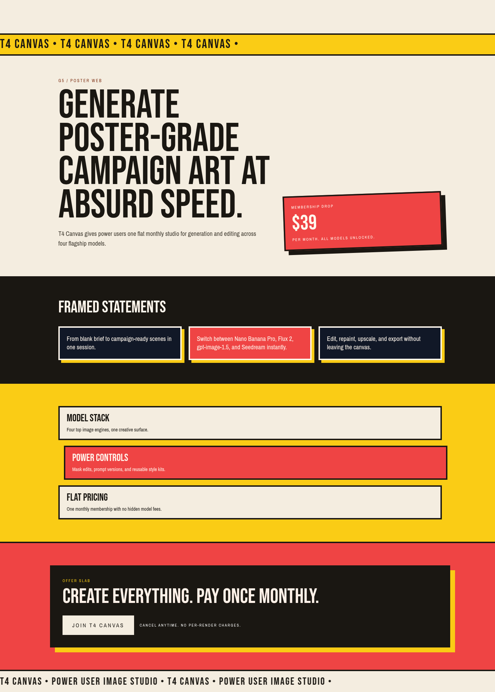

# Version 6

## Experiment Topology

horizontal

## Isolation Mode

isolated-fresh-app

## Hypothesis

Forcing unique section-graph assignments per route should increase structural divergence and reduce repeated section skeletons across `/1.. /5`.

## Mutation Axis

Section graph diversity

## Exact Skill Change

Added a version-specific section-graph diversity gate that maps each route to a fixed unique graph id and adds pass/fail checks for repeated section order and repeated transition patterns.

## Expected Visual Delta

Routes should feel more architecturally distinct, with clearer rhythm differences between hero, middle bands, and conversion sections.

## Measured Result

Route-graph divergence improved materially across `/1.. /5` with stronger architectural separation and fewer repeated skeletons; interaction depth and visual finish remain mid-tier. Scored `14.2/20` (avg `1.42`), up from baseline.

## Keep / Drop

Keep as primary vertical-refinement parent.

## Screenshots

Responsive screenshots are stored under `screenshots/<route>/`.

### Route /1
- mobile: [screenshots/1/mobile.png](screenshots/1/mobile.png)
- tablet: [screenshots/1/tablet.png](screenshots/1/tablet.png)
- laptop: [screenshots/1/laptop.png](screenshots/1/laptop.png)

### Route /2
- mobile: [screenshots/2/mobile.png](screenshots/2/mobile.png)
- tablet: [screenshots/2/tablet.png](screenshots/2/tablet.png)
- laptop: [screenshots/2/laptop.png](screenshots/2/laptop.png)

### Route /3
- mobile: [screenshots/3/mobile.png](screenshots/3/mobile.png)
- tablet: [screenshots/3/tablet.png](screenshots/3/tablet.png)
- laptop: [screenshots/3/laptop.png](screenshots/3/laptop.png)

### Route /4
- mobile: [screenshots/4/mobile.png](screenshots/4/mobile.png)
- tablet: [screenshots/4/tablet.png](screenshots/4/tablet.png)
- laptop: [screenshots/4/laptop.png](screenshots/4/laptop.png)

### Route /5
- mobile: [screenshots/5/mobile.png](screenshots/5/mobile.png)
- tablet: [screenshots/5/tablet.png](screenshots/5/tablet.png)
- laptop: [screenshots/5/laptop.png](screenshots/5/laptop.png)

