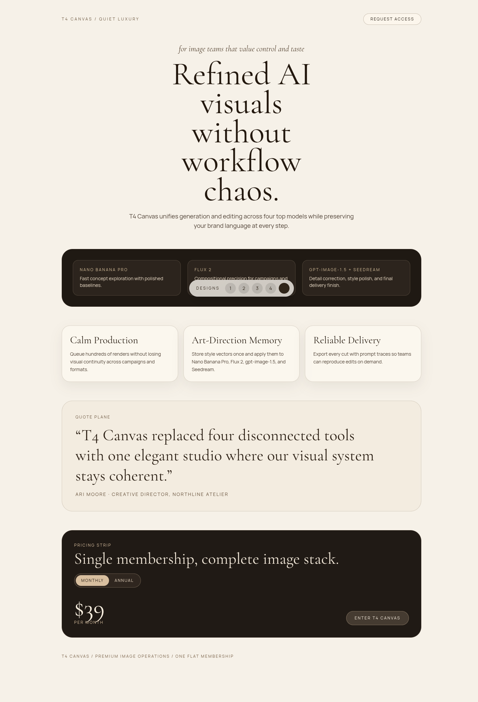

# Version 8

## Experiment Topology

horizontal

## Isolation Mode

isolated-fresh-app

## Hypothesis

Stricter palette budgeting and contrast discipline should improve polish, readability, and premium visual finish without reducing creativity.

## Mutation Axis

Color system discipline

## Exact Skill Change

Added a version-specific color discipline gate with dominant/support/accent budgeting, explicit contrast checks, and restrictions on noisy multi-hue gradients.

## Expected Visual Delta

Cleaner color hierarchy, better text contrast, and more controlled accent usage across all routes.

## Measured Result

Color hierarchy and contrast discipline improved polish in strong routes (`/2`, `/4`, `/5`), but composition density became uneven and some routes stayed too sparse. Scored `13.1/20` (avg `1.31`), below `version-6`.

## Keep / Drop

Partial keep: retain palette budgeting checks, drop strict anti-multi-hue limits that reduce section richness.

## Screenshots

Responsive screenshots are stored under `screenshots/<route>/`.

### Route /1
- mobile: [screenshots/1/mobile.png](screenshots/1/mobile.png)
- tablet: [screenshots/1/tablet.png](screenshots/1/tablet.png)
- laptop: [screenshots/1/laptop.png](screenshots/1/laptop.png)

### Route /2
- mobile: [screenshots/2/mobile.png](screenshots/2/mobile.png)
- tablet: [screenshots/2/tablet.png](screenshots/2/tablet.png)
- laptop: [screenshots/2/laptop.png](screenshots/2/laptop.png)

### Route /3
- mobile: [screenshots/3/mobile.png](screenshots/3/mobile.png)
- tablet: [screenshots/3/tablet.png](screenshots/3/tablet.png)
- laptop: [screenshots/3/laptop.png](screenshots/3/laptop.png)

### Route /4
- mobile: [screenshots/4/mobile.png](screenshots/4/mobile.png)
- tablet: [screenshots/4/tablet.png](screenshots/4/tablet.png)
- laptop: [screenshots/4/laptop.png](screenshots/4/laptop.png)

### Route /5
- mobile: [screenshots/5/mobile.png](screenshots/5/mobile.png)
- tablet: [screenshots/5/tablet.png](screenshots/5/tablet.png)
- laptop: [screenshots/5/laptop.png](screenshots/5/laptop.png)

